# Photography
[TOC]
## Architecture

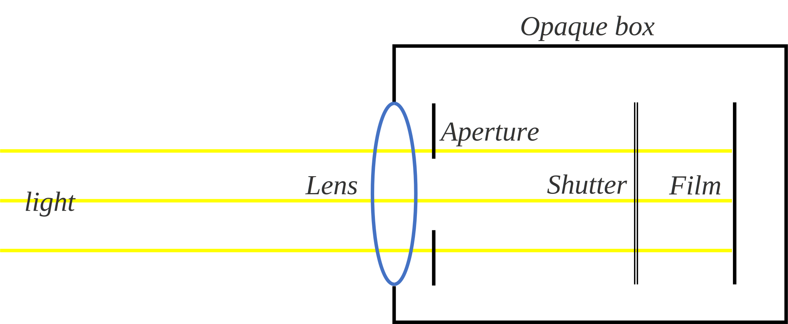

1. Opaque box
2. Lens
3. Aperture
4. Shutter
5. Film

### Lens & Focal length

A **lens group** is an optical element composed of multiple lenses, whose purpose is to focus or diverge the incident light beam. Lens groups usually consist of convex lenses and concave lenses to achieve specific optical effects. In optical systems, lens groups can be used to achieve many functions, including focusing, imaging, color correction, etc.

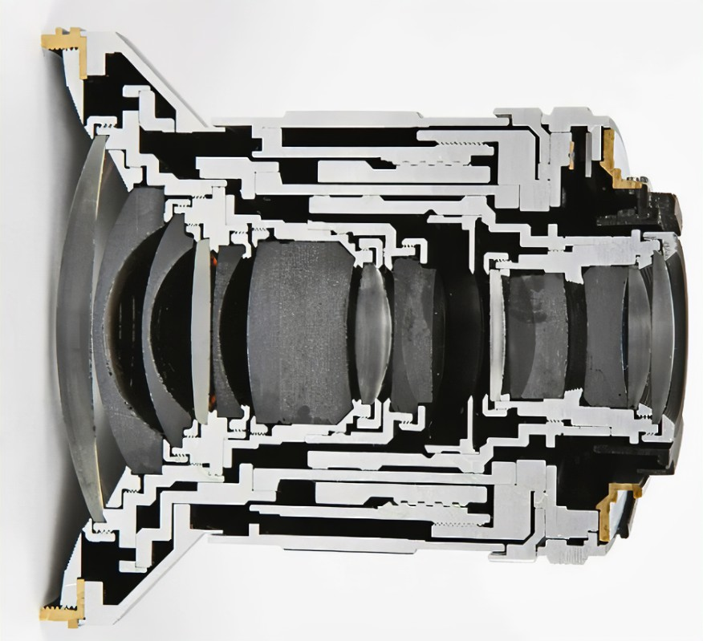

**Focal length** is the distance from the lens to the closest point at which it can focus light (called the object distance). In a convex lens, the focal length is positive, while in a concave lens, it is negative. Focal length can be calculated from the radius of curvature of the lens and the refractive index.

### Aperture
**Aperture** is an adjustable hole that controls the amount of light entering the lens. The size of the aperture affects the amount of light entering the camera lens, which in turn affects the exposure and depth of field of the photo.

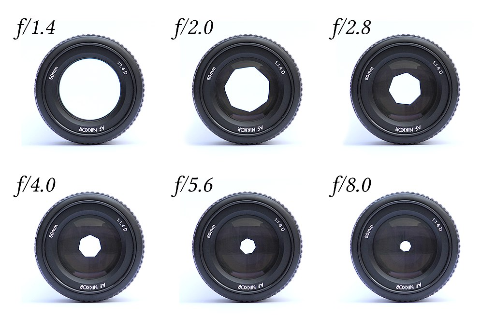

### Shutter & Shutter Speed
**Shutter** is a device that controls the length of time that light enters the photosensitive element.

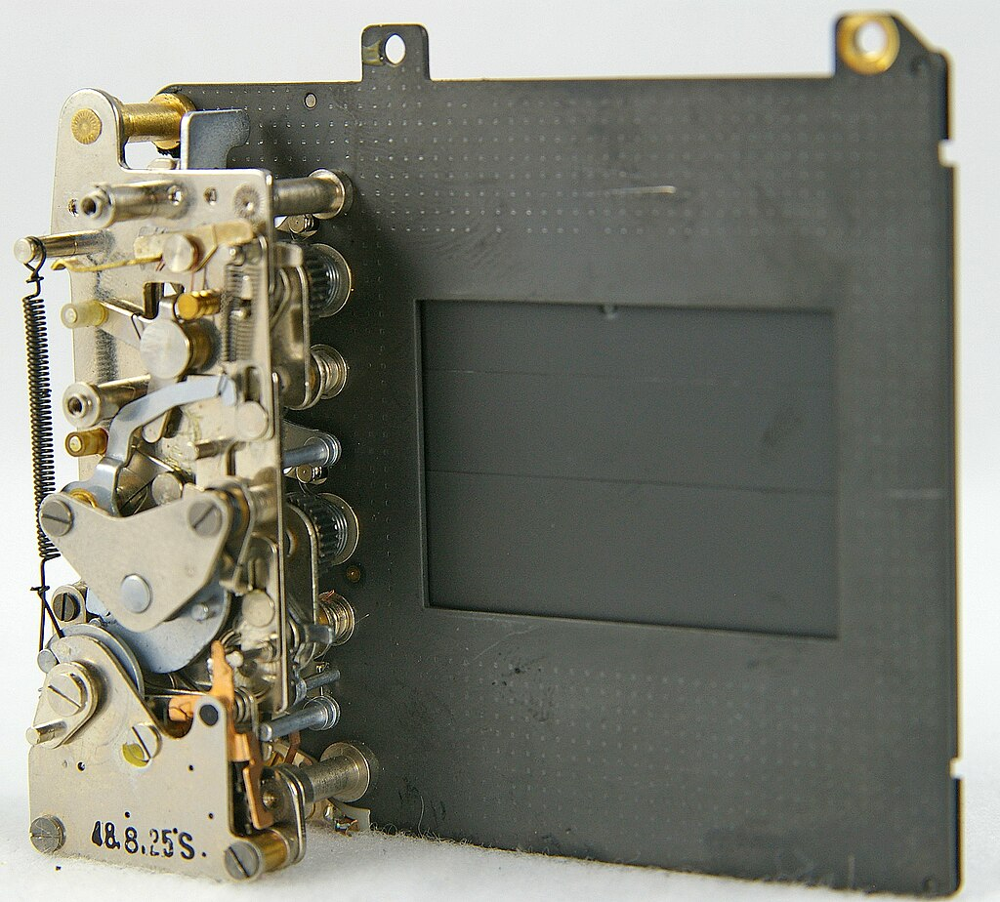

**Shutter Speed** is the length of time that the film or digital sensor inside the camera is exposed to light (that is, when the camera's shutter is open) when taking a photograph.

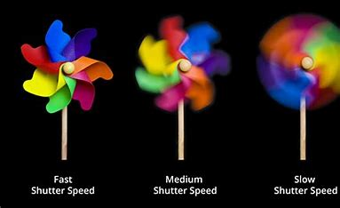

### Film & Sensitivity

**Film** is a photosensitive element whose main function is to form an image by capturing and recording light.

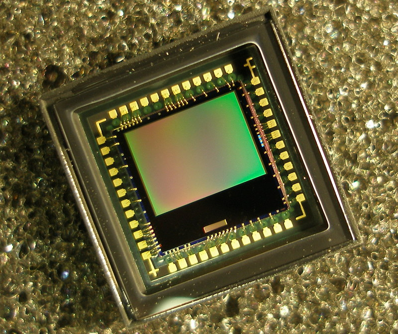

**Sensitivity** (ISO) refers to a standard used to measure the sensitivity of camera photosensitive materials to light. Higher sensitivity equals clearer photos in low light but may increase noise, while lower ISO reduces noise but requires more light for clear photos.

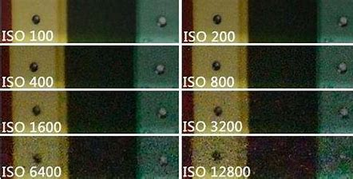

## Property

### Exposure

**Exposure** refers to the brightness level in a photo, used to describe the amount of light that a photographic film or digital sensor is exposed to. Exposure is generally controlled by three factors: Shutter Speed, Aperture, ISO Sensitivity.

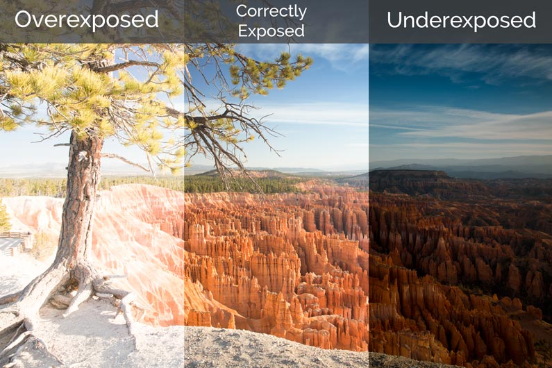

$$
\text{size of aperture} \uparrow \quad\Rightarrow\quad \text{exposure} \uparrow  \\
\text{time of shutter} \uparrow \quad\Rightarrow\quad \text{exposure} \uparrow  \\
\text{film sensitivity} \uparrow \quad\Rightarrow\quad \text{exposure} \uparrow
$$

### Depth of field

**Depth of field** describes the range in a photo that maintains sharpness from before focus to after focus. A smaller aperture increases the depth field so that more objects are in focus, while a larger aperture shrinks the depth field so that fewer objects are in focus.

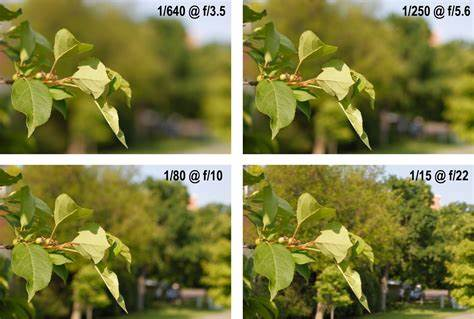

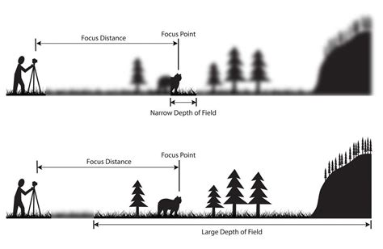
$$
\text{size of aperture} \uparrow \quad\Rightarrow\quad \text{depth of field} \downarrow
$$

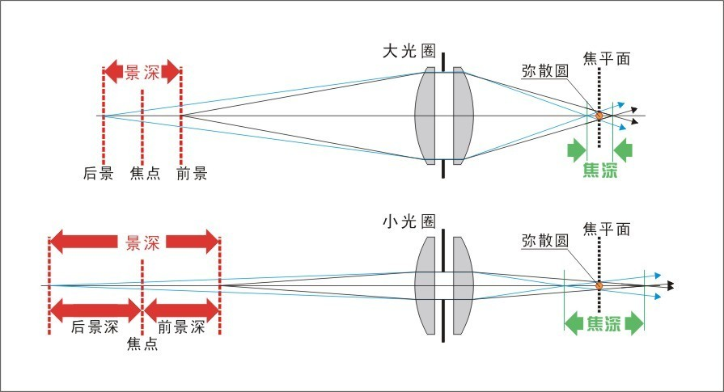
$$
\text{focal length} \uparrow \quad\Rightarrow\quad \text{depth of field} \downarrow
$$

### Angle of view

**Angle of view** refers to the range that can be observed by the camera. It is usually described in degrees or the size of the field of view relative to the camera or eye. A wider angle means a wider view, while a smaller angle means a narrower view.

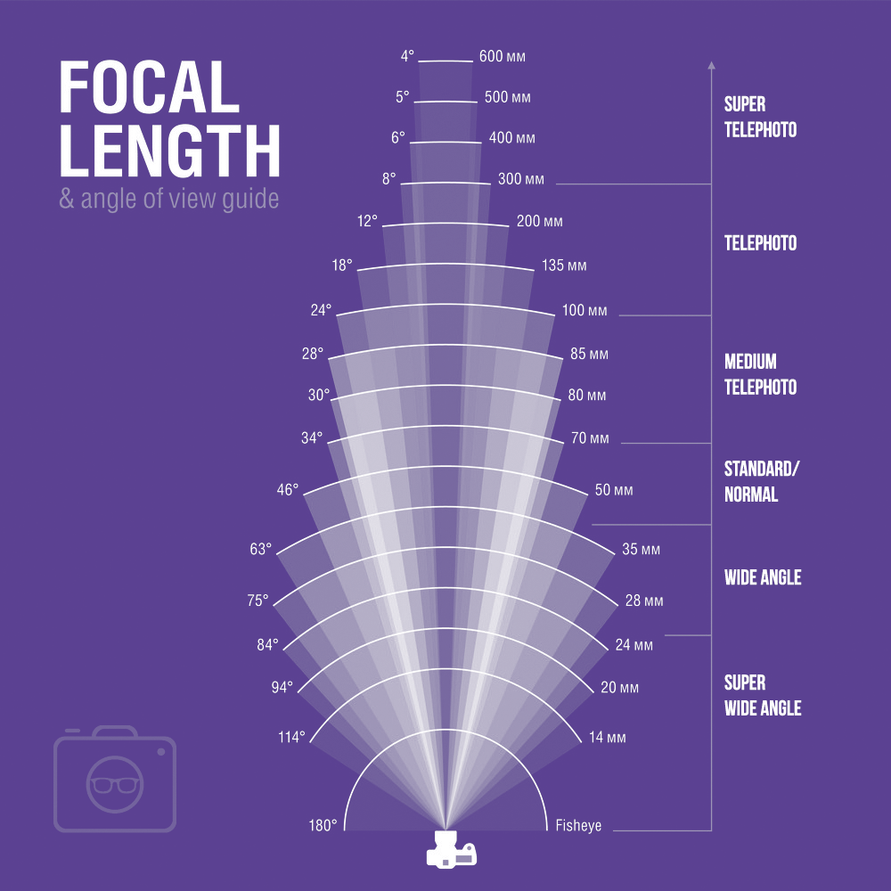

$$
\text{focal length} \uparrow \quad\Rightarrow\quad \text{angle of view} \downarrow
$$

## Light source

### Direct & Scattered light

**Direct light**: Direct light refers to light that travels directly from its source to a surface without being significantly altered or scattered by any intervening medium or objects. It typically creates sharp shadows and highlights on surfaces, and its intensity diminishes with distance from the source according to the inverse square law.

**Scattered light**: Scattered light refers to light that has been diffused or dispersed in various directions due to interactions with particles or surfaces in the medium through which it passes. This scattering can occur as a result of reflection, refraction, or diffraction. Scattered light tends to create softer shadows and more even illumination on surfaces compared to direct light.

### Direction of light projection

- **Frontlight**: The light source is positioned in such a way that it shines directly onto the subject from a direction facing the camera.
- **Front Side Light**: The light that projects at an approximately 45-degree angle horizontally from the camera lens direction is called front side light.
- **Sidelight**: The light that projects at approximately 90-degree angle horizontally from the camera's optical axis direction is called sidelight.
- **Side Backlight**: The light that projects at approximately 135-degree angle horizontally from the camera lens direction is called side backlight.
- **Backlight**: The light that comes from behind the subject and is opposite to the camera's optical axis direction is called backlight.

### Light source function

- **Main light**: The main light used to shape the subject, which is the most eye-catching light in the picture.
- **Auxiliary light**: The light in the shadow area after supplementing the main light illumination is called auxiliary light.
- **Background light**: The light specifically used to illuminate the background is called background light.

## Photography Skills

### Composition

- Central composition

- Horizontal line composition

- Vertical line composition

- Tripartite composition

- Symmetrical composition

- Diagonal composition 

- Frame composition

- Repetitive composition

### Light & shade

