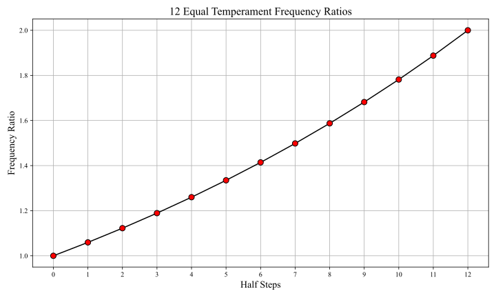
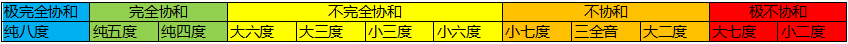
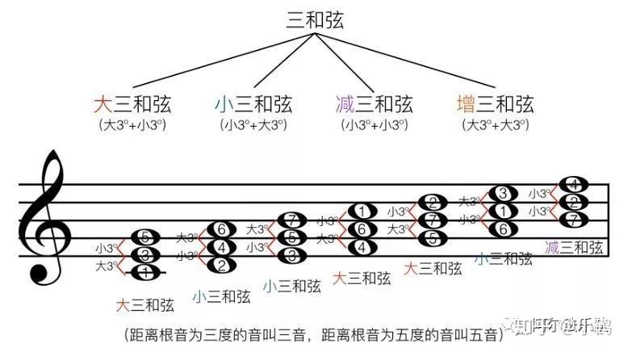
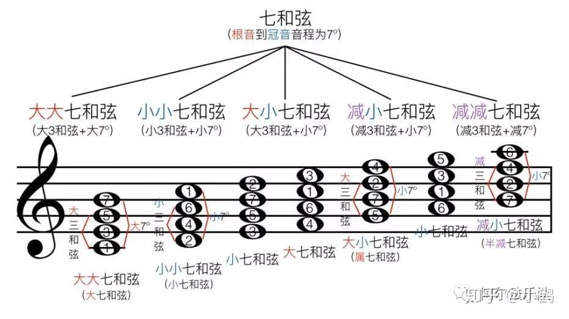
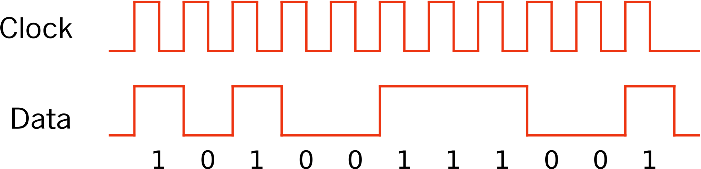
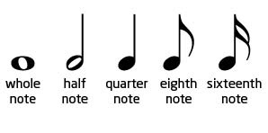
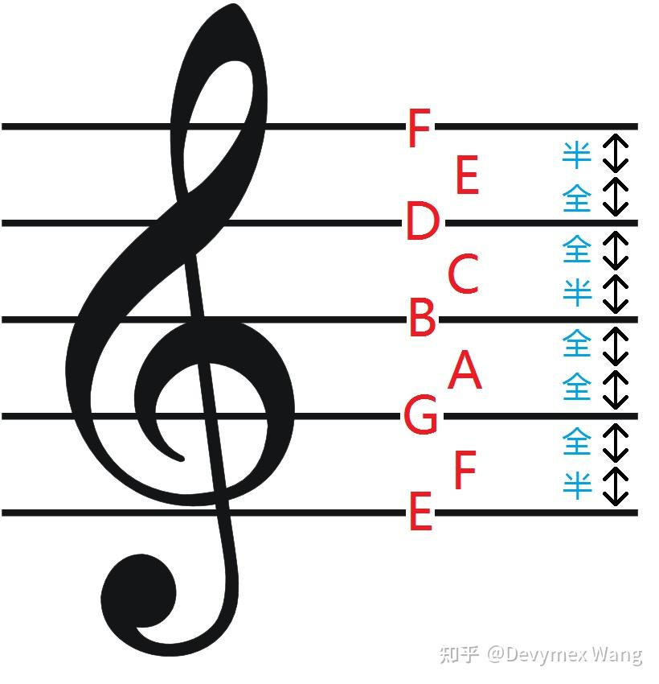

# Music Theory

[TOC]

## Pitch

### 12 Equal temperament
$$
\{f, 2^\frac{1}{12}f, ..., 2f\}
$$

**12 equal temperament**, is the musical system that divides the octave $[f, 2f]$ into 12 parts, with a ratio of adjacent pitches equal to $2^{1/12} \simeq 1.05946$.

### Interval

**Interval**, refers to the difference in pitch between two notes. Here is a table listing the different types of intervals.

| Number of Half Steps | Interval Type | Name       |
|:--------------------------------:|:------------:|:------------:|
| 0                              | Unison     | Perfect    |
| 1                              | Second     | Major      |
| 2                              |            | Minor      |
| 3                              | Third      | Major      |
| 4                              |            | Minor      |
| 5                              | Fourth     | Perfect    |
| 6                              | Tritone      |     |
| 7                              | Fifth      | Perfect    |
| 8                              | Sixth      | Major      |
| 9                             |            | Minor      |
| 10                            | Seventh    | Major      |
| 11                            |            | Minor      |
| 12                             | Octave     | Perfect    |

### Scale

Middle C
$$
C_4: 440 Hz
$$

|      | C    | D    | E    | F    | G    | A    | B    |      |      |      |      |
| ---- | ---- | ---- | ---- | ---- | ---- | ---- | ---- | ---- | ---- | ---- | ---- |
|      | 0    |      |      |      |      |      |      |      |      |      |      |

## Harmony

**Harmony** refers to the simultaneous combination of different pitches, tones, or chords to produce a pleasing effect.

| 音程 | 频率比 $\sim$ 近似整数比 | 最小公倍数 |
| :----: | :----------------: | :----------: |
| 12   | $1 : 2 \sim 1:2$ | 2 |
| 7    | $1 : 1.498 \sim 2:3$ | 6 |
| 5    | $1 : 1.335 \sim 3:4$ | 12 |
| 9    | $1 : 1.682 \sim 3:5$ | 15 |
| 4    | $1 : 1.260 \sim 4:5$ | 20 |
| 3    | $1 : 1.189 \sim 5:6$ | 30 |
| 8    | $1 : 1.587 \sim 5:8$ | 40 |
| 10   | $1 : 1.782 \sim 5:9$ | 45 |
| 6    | $1 : 1.414 \sim 7:10$ | 70 |
| 2    | $1 : 1.122 \sim 8:9$ | 72 |
| 11   | $1 : 1.887 \sim 8:15$ | 120 |
| 1    | $1 : 1.059 \sim 15:16$ | 240 |

### Chord

A chord is a combination of three or more notes played simultaneously. Chords in music can be categorized into various types based on their construction, function, and characteristics. Here's a list of some common types of chords:

#### Triad

Triad, refers to a three-note chord consisting of a root note, a third interval above the root, and a fifth interval above the root.

- **Major Triad:** Consists of a root, major third, and perfect fifth interval. It has a bright and stable sound.

- **Minor Triad:** Consists of a root, minor third, and perfect fifth interval. It has a more somber or melancholic sound compared to major triads.

- **Diminished Triad** 

- **Augmented Triad**

#### Seventh Chord

Seventh Chord (Dominant 7th, Major 7th, Minor 7th, Half-diminished 7th, Diminished 7th)

#### Suspended Chord

(sus2, sus4)

#### Ninth Chord

(Dominant 9th, Major 9th, Minor 9th)

## Tonality

**Tonality** refers to the organization of pitches and harmonies around a central note, known as the tonic.

#### Natural major scale 

The natural major scale consists of seven different pitches arranged in a specific pattern of whole steps (W) and half steps (H). This pattern is consistent across all major scales, regardless of the starting note. The pattern of whole and half steps ensures that each note in the scale maintains the same relationship with the tonic (the starting note). This pattern of intervals creates a sense of tonality and hierarchy within the scale, with the tonic serving as the central point of stability.
$$
(W, W, H, W, W, W, H)
$$

- **C major**: $(C, D, E, F, G, A, B, C)$. 

#### Natural minor scale 

The natural minor scale is characterized by its unique pattern of intervals and its distinct tonal qualities, which impart a somber or melancholic mood compared to the brighter and happier sound of the major key. The pattern for the natural minor scale is as follows.

$$
(W, H, W, W, H, W, W)
$$

## Beat & Rhythm

### Beat

**Beat** is the steady pulse or recurring unit of time that underlies a piece of music. The beat is typically consistent throughout a piece of music and serves as the foundation upon which the rhythm is built.

**Rhythm** refers to the patterns of sounds and silences within a piece of music in relation to the beat. It's the way musical notes and rests are organized in time. Rhythm adds complexity to the music by varying the duration and timing of notes relative to the underlying beat.

**Measure** is a segment of time defined by a specific number of beats, as indicated by the time signature.

### Note value

**Note value** refers to the duration of a note or how long it is held or played. 

| Note values  |                  Durations                   |
| :----------: | :------------------------------------------: |
|  Whole Note  |  lasts for four beats in 4/4 time signature  |
|  Half Note   |  lasts for two beats in 4/4 time signature  |
| Quarter Note |  lasts for one beat in 4/4 time signature   |
| Eighth Note  | lasts for half a beat in 4/4 time signature |
|Sixteenth Note|lasts for a quarter of a beat in 4/4 time signature|

### Meter

**Meter** refers to the organization of beats into recurring patterns of strong and weak accents. Meter provides a framework for understanding the rhythmic structure of a piece of music. It's often represented by a time signature at the beginning of a piece $\frac{m}{n}$, the top number $m$ indicates the number of beats per measure, the bottom number $n$ indicates the type of note that represents one beat.

## Recording method: Staff

五线谱由五条水平的线组成，这些线从上到下依次表示音符的音高。线条之间的空隙称为间隔，它们代表了不同的音高。音符是五线谱中表示音高和持续时间的图形符号. 休止符用来表示一段时间内的静音. 调号是五线谱头部的符号，用来确定乐曲的调性。常见的调号包括升调号和降调号，它们分别表示提高或降低特定的音符半音。节拍符号用来表示音乐的节奏。用来连接音符，表示它们要被连续演奏。在五线谱中，长音符通常会用连线连接起来。在五线谱的末尾用来表示乐曲的结束。

