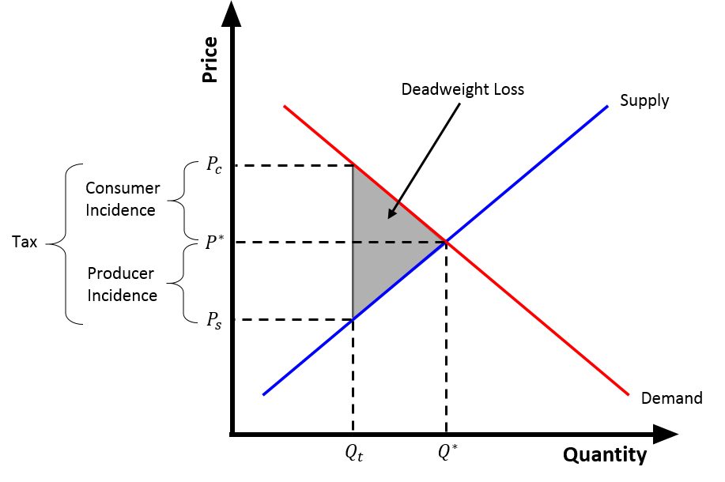

# Micro-Economics

[TOC]

## Micro-Economics Model

$$
consumers \overset{demand}{\Longleftarrow} markets \overset{supply}{\Longleftarrow} producers
$$

This **circular flow of economic activity** keeps the economy in motion, where the actions of consumers and producers are linked through markets, ensuring the distribution and exchange of resources.

- Consumers **demand** goods and services, creating the market's need for supply.
- Producers **supply** goods and services, which meet the demand from consumers.
- The interaction between supply and demand in the market helps establish equilibrium prices and quantities, facilitating the exchange of goods and services.

## Quantity-Price relationship $Q\text{-}P$

In economics, the vertical axis is the independent variable and the horizontal axis is the dependent variable.

### Demand: $Q_d\text{-}P$

$$
Q_d = f(P)\\
Q_d = a - bP    \tag{demand function}
$$

The demand function usually shows an inverse relationship between quantity demanded and price, meaning as price increases, the quantity demanded tends to decrease, and vice versa.

- $Q_d$: represents the quantity demanded of a good or service.
- $P$: represents the price of the good or service.
- $a$ is the intercept (quantity demanded when $P = 0$),
- $b$ is the slope (the change in quantity demanded for a change in price).

需求水平的变化：曲线的移动. 非价格因素包括消费者的收入水平、相关商品的价格、消费者偏好和消费者对商品价格的预期，当商品自身价格不变时，非价格因素变动会导致整条需求曲线的移动。

### Supply: $Q_s\text{-}P$

$$
Q_s = f(P)\\
Q_s = c + dP  \tag{supply function}
$$

The **supply function** expresses the relationship between the quantity supplied (\( Q_s \)) and the price (\( P \)). In most cases, supply increases as price increases, and this positive relationship is often represented by a linear function

- $Q_s$ represents the quantity supplied.
- $P$ represents the price of the good or service.
- $c$ is the intercept (quantity supplied when $P = 0$).
- $d$ is the slope (the change in quantity supplied for a change in price).

### Price: Supply-Demand Balance

$$
Q_d = Q_s
$$

In a competitive market, the price $P$ will adjust until the amount of goods supplied ($Q_s$) equals the amount of goods demanded ($Q_d$). This balance is called the market equilibrium.

### Elasticity: Derivative with Normalized Units

$$
e = \frac{\frac{\Delta y}{y}}{\frac{\Delta x}{x}} = \frac{\mathrm d y}{\mathrm d x}\frac{x}{y}  \tag{Elasticity}
$$

**Elasticity** measures the responsiveness of one variable to changes in another variable. Elasticity emphasizes the proportional relationship between variables, can reflect the sensitivity of price changes to changes in demand or supply, ra+++++ther than just the rate of change at a certain point.

- If $E_s > 1$, $e$ is **elastic**.
- If $E_s < 1$, $e$ is **inelastic**.
- If $E_s = 1$, $e$ is **unit elastic**.

#### Price Elasticity of Demand (PED)
$$
E_d = \frac{\% \text{ change in quantity demanded}}{\% \text{ change in price}}\\
E_d = \frac{\mathrm dQ_d}{\mathrm dP} \frac{P}{Q_d}
$$
**Price Elasticity of Demand (PED)** refers to the responsiveness of the quantity demanded of a good or service to changes in its price.

- $E_d$ is the price elasticity of demand.
- $Q_d$ is the quantity demanded.
- $P$ is the price.
- $\frac{dQ_d}{dP}$ is the derivative of the quantity demanded with respect to price, representing the rate of change in demand as price changes.

#### Price Elasticity of Supply (PES)
$$
E_s = \frac{\% \text{ change in quantity supplied}}{\% \text{ change in price}}\\
E_s = \frac{\mathrm dQ_s}{\mathrm dP} \frac{P}{Q_s}
$$

**Price Elasticity of Supply (PES)** refers to the responsiveness of the quantity supplied of a good or service to changes in its price.

- $E_s$ is the price elasticity of supply.
- $Q_s$ is the quantity supplied.
- $\frac{dQ_s}{dP}$ is the derivative of the quantity supplied with respect to price, representing the rate of change in supply as price changes.

### Relationships between different goods: Substitutes & Complements

$$
\begin{align*}
\frac{\partial Q_X}{\partial P_Y} &> 0  \tag{Substitutes}\\
\frac{\partial Q_X}{\partial P_Y} &< 0  \tag{Complements}
\end{align*}
$$

**Substitutes**: refer to situations where two goods can substitute for each other. If two goods are substitutes, it means that they meet similar needs and consumers can choose either of them. When the price of a certain good increases, consumers will switch to buying another similar good, resulting in an increase in the demand for the latter.

**Complementary**: refer to two goods that are usually consumed together. If two goods are complementary, it means that they are used together and usually cannot be used separately. Price changes will have opposite effects on their demand. That is, when the price of one good increases, consumers will usually reduce their demand for the other good.

### Tax: Tax Wedge

The tax wedge is the deviation from the equilibrium price and quantity as a result of the taxation of a good. The elasticity of demand and supply determines how the tax burden is shared between buyers and sellers. The burden of a tax falls more heavily on the inelastic side of the market.

- When demand is more inelastic than supply, consumers bear more of the tax.
- When supply is more inelastic than demand, producers bear more of the tax.

## Consumer

### Demand-Income

$$
Q_d = f(I)  \tag{Demand-Income}
$$

A demand-income curve shows the relationship between a consumer's income and the quantity of a good or service they are willing to purchase at different income levels.

- Luxury goods: Income elasticity $\epsilon > 1$
- Necessary goods: Income elasticity $0 < \epsilon < 1$
- Giffen goods: Income elasticity $\epsilon < 0$

### Utility

**Total Utility (TU)** refers to the overall satisfaction or happiness a consumer receives from consuming a certain quantity of a good or service. It increases as the quantity of the good consumed increases, but it does so at a diminishing rate due to the principle of diminishing marginal utility.

#### Cardinal Utility & Ordinal Utility

**Cardinal Utility** can be measured in specific units (e.g., utils), and consumers can express and compare the exact amount of satisfaction they get from different goods. The utility is treated as a measurable quantity that can be added, subtracted, or compared across different goods.

**Ordinal Utility** assumes that utility cannot be measured in exact units but can only be ranked. Consumers can rank their preferences for different goods but cannot assign precise values to them. This approach is more commonly used in modern economic theory.

 Ordinal Utility：$X_1\text{-}X_2$ Indifference Curve

#### Marginal Utility: Diminishing Marginal Utility

$$
\text{MU} = \frac{\mathrm dU_s}{\mathrm dx}\\
\frac{\mathrm d \text{MU}}{\mathrm dx} = \frac{d^2U}{dx^2} < 0
$$

Marginal utility is the derivative of effective utility. The concept of **diminishing marginal utility** means that as consumption increases, the marginal utility $MU$ decreases, the second-order derivative of total utility is less than zero, indicating that the growth rate of total utility will slow down as consumption increases.

- $x$ is the quantity of the good consumed

### Budget

$$
P_X \cdot Q_X + P_Y \cdot Q_Y = I
$$

**Budget Constraint**: The consumer's total spending on goods and services must equal their income.
- $P_X$ and $P_Y$ are the prices of goods $X$ and $Y$,
- $Q_X$ and $Q_Y$ are the quantities of goods $X$ and $Y$,
- $I$ is the consumer's income.

### Consumer Equilibrium

$$
\frac{\text{MU}_X}{P_X} = \frac{\text{MU}_Y}{P_Y}  \\
\frac{\frac{\partial U}{\partial X}}{P_X} = \frac{\frac{\partial U}{\partial Y}}{P_Y}
$$

Consumer Equilibrium is a state in which a consumer achieves the maximum satisfaction (utility) possible given their budget constraint and the prices of goods and services. Consumer equilibrium occurs when the marginal utility per dollar spent on each good is equal. At this point, the consumer has allocated their income in such a way that they cannot increase their utility by reallocating their spending between different goods. 

## Producer

### Production curve: $Q\text{-}(L, F)$

The production curve illustrates how output changes as more of an input (such as labor or capital) is employed, while other inputs are held constant.

### Cost curve: $C\text{-}Q$

- Short-term cost curve

- Long-term cost curve
  - The long-run cost curve is the **envelope** of the short-run cost curves.

## Markets

### Perfect Competition Market

- Large Number of Buyers and Sellers: No single buyer or seller can influence the market price.
- Homogeneous Products: All products are identical and indistinguishable from each other.
- Free Entry and Exit: Firms can enter or exit the market without restrictions.
- Perfect Information: All participants have complete knowledge of prices and products.
- Price Taker Behavior: Firms accept the market-determined price because no single firm can influence it.

### Perfect Monopoly Market

A perfect monopoly market occurs when a single firm is the sole producer and seller of a product with no close substitutes.

- The monopolist maximizes profit where Marginal Revenue (MR) = Marginal Cost (MC).

- This typically leads to higher prices and lower output compared to perfect competition, creating deadweight loss.
- The monopolist achieves supernormal profits in the long run.

### Oligopoly Market

An oligopoly market is dominated by a small number of firms that are interdependent in their decision-making. A handful of firms control the market. Firms consider competitors' actions when making decisions. High costs or strategic barriers prevent new firms from entering. Products may or may not be identical.

#### Cournot Model

The Cournot Model explains firm behavior in an oligopoly where firms compete on quantity rather than price. Each firm assumes that its competitors’ output remains constant while deciding its output. Cournot Equilibrium, where each firm's output maximizes its profit given the output of others. As the number of firms increases, the Cournot outcome approaches the competitive market outcome. Firms restrict output to maintain higher prices than in perfect competition.

### Market Failure

Market failure occurs when the allocation of goods and services in a free market is inefficient, leading to a loss of social welfare.

## Welfare Economics

Welfare Economics focuses on the optimal allocation of resources to maximize social welfare.
