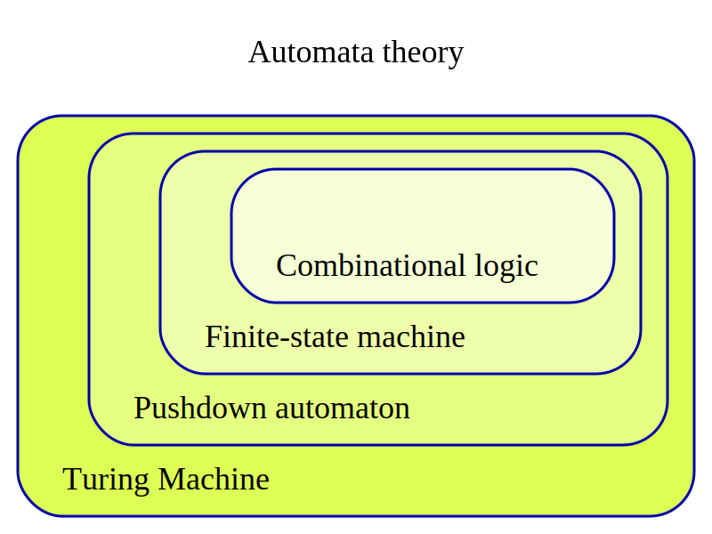

# Digital Circuit

[TOC]

## Basic Principles

### Basic Boolean operation: AND & OR & NOT

$$
\begin{align*}
C &= A \cdot B \tag{And}\\  
C &= A\ |\ B  \tag{Or}\\
C &= \bar A\tag{Not}\\
\end{align*}
$$

AND, OR, NOT gates belong to the Boolean operation system. 

- AND: The result is true only when both inputs are true.
- OR: The result is true when at least one input is true
- NOT: Inverts the value of a single input.

| $A$ | $B$ | $A \cdot B$ |
|--------|--------|------|
|   0    |   0    |   0  |
|   0    |   1    |   0  |
|   1    |   0    |   0  |
|   1    |   1    |   1  |

| $A$ | $B$ | $A\ |\ B$ |
|--------|--------|------|
|   0    |   0    |   0  |
|   0    |   1    |   1  |
|   1    |   0    |   1  |
|   1    |   1    |   1  |

| $A$ | $\bar A$ |
|------|------|
|   0  |   1  |
|   1  |   0  |

### Boolean operation: XOR (exclusive OR)

$$
\begin{align*}
A \oplus B &= (A \land \neg B) \lor (\neg A \land B)  \tag{XOR}\\
\end{align*}
$$

$A \oplus B$: The XOR (exclusive OR) operation, where the result is true if and only if exactly one of $A$ or $B$ is true, but not both. The XOR operation has a very important property: it is reversible $A \oplus B = C \Rightarrow A \oplus C = B$. AND, OR, and NOT are mainly used to describe the logical relationship of "all conditions are met" or "at least one condition is met", while XOR focuses more on describing the logical relationship of "two conditions are different".

| A    | B    | $A \oplus B$ |
| ---- | ---- | ------- |
| 0    | 0    | 0       |
| 0    | 1    | 1       |
| 1    | 0    | 1       |
| 1    | 1    | 0       |

### Optimization method of Boolean expression

#### Karnaugh Map

### Sequential logic & Clock

a **clock** is a timing signal that coordinates the operation of various components within the circuit. It provides a periodic pulse, typically a square wave, that controls the timing of sequential elements such as flip-flops, registers, and counters. The clock ensures that operations are synchronized, preventing components from performing actions out of sequence.

## Combinational logic circuits

Half Adder adds two binary digits (bits) and outputs a sum and a carry bit. 
$$
S = A ⊕ B  \\
C = A ∧ B
$$
- Inputs: A, B
- Outputs: Sum, Carry
- $S$: Sum
- $C$ = Carry

**Full Adder**: A full adder adds three bits (two input bits and a carry-in from the previous addition) and produces a sum and a carry-out.
$$
\begin{align*}
S &= A ⊕ B ⊕ C_in  \\
C_{out} &= (A ∧ B) ∨ (C_in ∧ (A ⊕ B))
\end{align*}
$$

- Inputs: A, B, Carry-in (C_in)
- Outputs: Sum (S), Carry-out (C_out)
- $S$: Sum
- $C_{in}$ = Carry-in
- $C_{out}$ = Carry-out 

Multiplier: A multiplier performs multiplication of two binary numbers. The process involves multiplying the individual bits of the two binary numbers and adding them with appropriate shifts (similar to decimal multiplication). Booth’s Algorithm: This is an optimized method for binary multiplication, especially for signed numbers, which reduces the number of operations.

编码器与解码器

多路复用器与解复用器

比较器

译码器

## Sequential logic circuit

### Latch & Flip-Flop

A **latch** is a **level-sensitive** memory element. Its state can change as long as the control signal (such as enable) is active. When the control signal is inactive, the latch holds its state regardless of input changes.

A **flip-flop** is a type of latch that is **edge-triggered** rather than level-sensitive. This means a flip-flop only changes its state on the rising or falling edge of the clock signal. Flip-flops are more commonly used in sequential circuits where precise timing control is needed.

**SR Latch (Set-Reset Latch)**: A basic latch that has two inputs (Set and Reset) and two outputs (Q and Q'). It stores data based on the **Set** (S) and **Reset** (R) inputs, where:

|S	|R	|Q|Q'|
|:---:|:---:|:---:|:---:|
|0	|0	|Q (previous state)|Q' (previous state)|
|0	|1	|0|1|
|1	|0	|1|0|
|1	|1	|      Invalid       |Invalid|

**D Latch (Data Latch)**: The D latch has a single input (D for Data), a clock signal (C), and outputs Q and Q'. The D latch is edge-sensitive, meaning its state changes based on the clock signal. When the clock is active (C = 1), the D input is directly passed to the output Q. When the clock is inactive (C = 0), the output Q holds its previous state regardless of the D input.

| Clock | D | Q  | Q' |
|-----------|---|----|----|
| 0         | X | Q (previous state) | Q' (previous state) |
| 1         | 0 | 0  | 1  |
| 1         | 1 | 1  | 0  |

- SR锁存器、D触发器、JK触发器、T触发器

时钟与计数器

状态机（Moore、Mealy状态机）