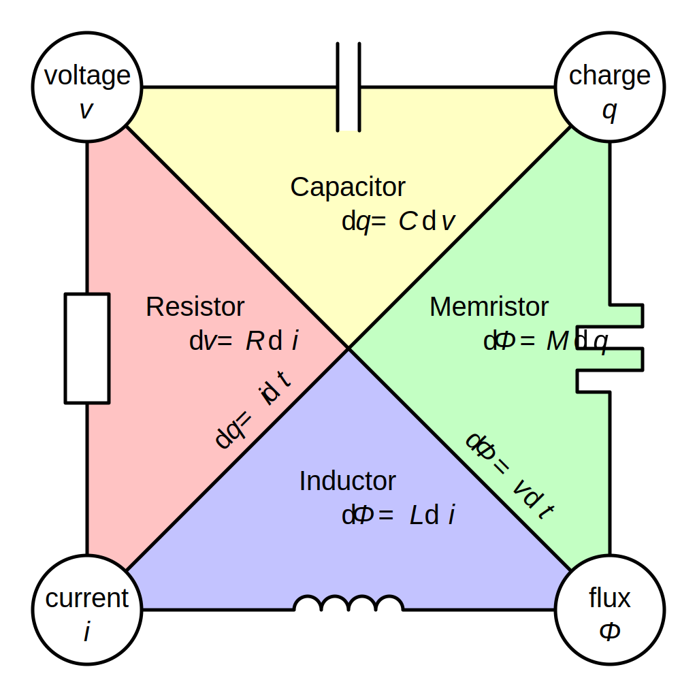
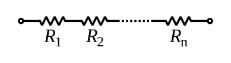
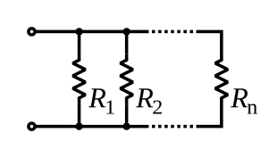
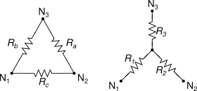
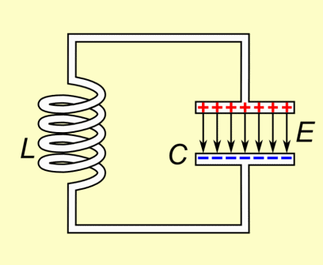

# Electrical network

[TOC]

## Principles

### Electrical network

An **electrical network** refers to a system of interconnected electrical components or devices that work together to transport electrical energy and provide a functional output. These networks include elements like resistors, capacitors, inductors, transformers, transmission lines, and other electrical devices, arranged in various configurations to form circuits.

### Basic physical quantities: Current & Voltage

$$
\begin{align*}
I &= \frac{\mathrm{d}Q}{\mathrm{d}t}  \tag{Current}\\
V &= -\frac{\mathrm{d}\Phi}{\mathrm{d}t}  \tag{Voltage}\\
\end{align*}
$$

**Current** is the flow of electric charge in a conductor. It is the rate at which charge is flowing through a given point in a circuit.

**Voltage** is the electric potential difference between two points in a circuit. It is what drives electric current to flow through a conductor (like a wire). Faraday's law states that a changing magnetic flux will induce a voltage (electromotive force) in a closed loop, and the magnitude of the induced voltage is proportional to the rate of change of the magnetic flux.

#### Conservation: Kirchhoff's circuit laws

$$
\begin{align*}
\sum_{\text{node}} I_i &= 0  \\
\sum_{\text{closed loop}} V_i &= 0
\end{align*}
$$

**Kirchhoff's current law**: The algebraic sum of currents in a network of conductors meeting at a point is zero.

**Kirchhoff's voltage law**: The directed sum of the potential differences (voltages) around any closed loop is zero.

#### Ideal Current source & Ideal Voltage source

A **Ideal voltage source** is an electrical component that provides a constant voltage across its terminals, regardless of the current drawn by the circuit. The source maintains a fixed potential difference between its two terminals.

A **Ideal current source** is an electrical component that provides a constant current through the circuit, regardless of the voltage across its terminals. The source maintains a fixed current, and the voltage will vary depending on the impedance of the circuit.

### Relation: Resistance & Capacitance & Inductance & Memristor

$$
\begin{align*}
R &= \frac{\mathrm{d}V}{\mathrm{d}I}  \tag{Resistance}\\
C &= \frac{\mathrm{d}Q}{\mathrm{d}V}  \tag{Capacitance}\\
L &= \frac{\mathrm{d}\Phi}{\mathrm{d}I}  \tag{Inductance}\\
M &= \frac{\mathrm{d}\Phi}{\mathrm{d}Q}  \tag{Memristor}\\
\end{align*}
$$

**Resistance** is the property of a material or component that resists the flow of electric current, causing a voltage drop when current flows through it.

**Capacitance** is the ability of a component (capacitor) to store electric charge. A higher capacitance means that the capacitor can store more charge for a given voltage.

**Inductance** is the property of a coil (inductor) that opposes changes in current. When current changes, it induces a magnetic field, and the changing magnetic flux generates a back electromotive force (EMF) that opposes the change in current.

**Memristor**: the resistance depends on the history of the charge that has flowed through it.

### Energy & Power

$$
\begin{align*}
W &= V \mathrm{d}q  \tag{Energy}\\
P &= \frac{\mathrm{d}W}{\mathrm{d}t} = UI  \tag{Power}
\end{align*}
$$

The power $P$ is the rate of change of energy with respect to time.

## Linear electrical network

$$
V = R I
$$

A **linear electrical network** refers to a network of electrical components in which the relationship between voltage and current is linear, meaning it obeys Ohm's law and the principle of superposition. In such networks, the voltage and current at any point are directly proportional, and the behavior of the components (like resistors, capacitors, inductors, voltage sources, and current sources) is governed by linear equations.

### Superposition Theorem

$$
V_{\text{total}} = V_1 + V_2 + \cdots + V_n
I_{\text{total}} = I_1 + I_2 + \cdots + I_n
$$

In a linear circuit, the response (voltage or current) to multiple independent sources (voltage or current) can be obtained by considering the effect of each source separately and then adding their responses.

- $V_{\text{total}}$ is the total voltage response
- $I_{\text{total}}$ is the total current response
- $V_1, V_2, \cdots, V_n$ is the voltage response of each source acting alone
- $I_1, I_2, \cdots, I_n$ is the current response of each source acting alone

### Power Conservation: Tellegen's Theorem

$$
\sum_{k=1}^{N} v_k \cdot i_k = 0
$$

Tellegen's Theorem states that in any linear, bilateral network (circuit), the sum of the power delivered to each element of the network is equal to the sum of the power absorbed by each element. This holds true regardless of the number of sources, resistors, capacitors, or inductors in the network.

- $v_k$ is the voltage across the $k$-th element,
- $i_k$ is the current through the $k$-th element,
- $N$ is the total number of elements in the network.

### Equivalent Principle: Thevenin's & Norton's Theorem

**Thevenin's Theorem** states that any linear electrical network with voltage sources, current sources, and resistances can be replaced by an equivalent circuit consisting of a single voltage source (Thevenin voltage) in series with a single resistance (Thevenin resistance).

**Norton's Theorem** states that any linear electrical network with voltage sources, current sources, and resistances can be replaced by an equivalent circuit consisting of a single current source (Norton current) in parallel with a single resistance (Norton resistance).

#### Equivalent methods of Resistor Network

##### Series & Parallel Resistor Network

$$
\begin{align*}
R_{total} &= R_1 + R_2 + R_3 + \cdots + R_n  \tag{Series}\\
\frac{1}{R_{total}} &= \frac{1}{R_1} + \frac{1}{R_2} + \frac{1}{R_3} + \cdots + \frac{1}{R_n}  \tag{Parallel}
\end{align*}
$$

In Series Resistor Network, the voltage across each resistor depends on its resistance, but the current through each is the same.

In Parallel Resistor Network, The current through each resistor depends on its resistance, but the voltage is the same across each resistor.

##### Y-network & Δ-network: Y-Δ transform

$$
\begin{align*}
R_{\Delta 1} &= \frac{R_{Y1} R_{Y2} + R_{Y2} R_{Y3} + R_{Y3} R_{Y1}}{R_{Y3}}  \\
R_{\Delta 2} &= \frac{R_{Y1} R_{Y2} + R_{Y2} R_{Y3} + R_{Y3} R_{Y1}}{R_{Y1}}  \\
R_{\Delta 3} &= \frac{R_{Y1} R_{Y2} + R_{Y2} R_{Y3} + R_{Y3} R_{Y1}}{R_{Y2}}  \\
R_{Y1} &= \frac{R_{\Delta 1} R_{\Delta 2}}{R_{\Delta 1} + R_{\Delta 2} + R_{\Delta 3}}  \\
R_{Y2} &= \frac{R_{\Delta 2} R_{\Delta 3}}{R_{\Delta 1} + R_{\Delta 2} + R_{\Delta 3}}  \\
R_{Y3} &= \frac{R_{\Delta 1} R_{\Delta 3}}{R_{\Delta 1} + R_{\Delta 2} + R_{\Delta 3}}
\end{align*} \tag{Y-Δ transform}
$$

The Y-network consists of three resistors arranged in a "Y" shape. The Δ-network consists of three resistors arranged in a triangle (delta). These can be transformed into the other form (Y to Δ or Δ to Y) to make analysis easier.

### LC Circuit

$$
f = \frac{\omega_0}{2\pi}=\frac{1}{2\pi\sqrt{LC}}
$$

## RC, RL, LC Passive Filters

②、替代定理；④、最大传输定理；⑥、互易定理；⑦、对偶原理
