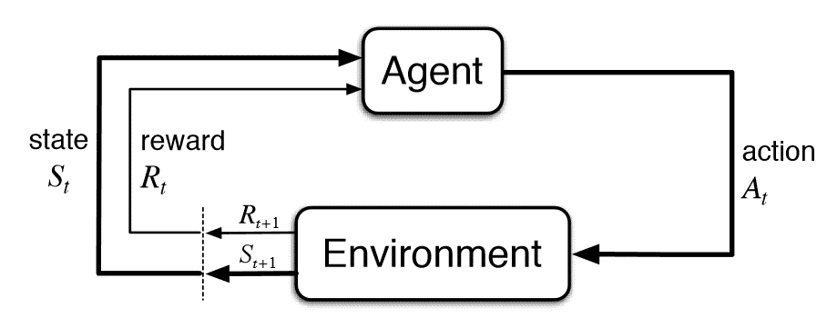

# Agent-Environment Learning

[TOC]

## Problem

Let **Agent** interact with unknown **Environment**, and learn how to choose actions $A$ in the current state $S$ to find strategies $\pi$ that can maximize the cumulative Reward $G$. 

The Environment feeds back status $S$ and rewards $R$ based on the action $A$ of the Agent each step.

$$
\max_{\pi} \quad G = \sum_{t = 0}^\infty R_t  \tag{objective}
$$

- $S$: State set.
- $A$: Action set.
- $R$: Reward for the step $t$.
- $t$: Time.
- $G$: Cumulative Reward of all steps.
- $\pi : S_t \to A_t$: Strategy, policy function.

### Cumulative reward & Reward discount
$$
G_t= \sum_{\tau = t+1}^T R_\tau  \tag{cumulative reward at $t$}
$$

The cumulative reward is the total accumulated reward an agent has obtained over a period of time. The goal of the agent at time $t$ is to maximize the cumulative reward from time step $t+1$ to the final time step $T$.
- $G_t$ is the cumulative reward starting from the time step $t+1$ up to the final time step $T$.
- $T$ is the termination time.
- $R_\tau$ is the reward at time step $\tau$

$$
\begin{align*}
G_t &= \sum_{k=0}^∞ γ^k R_{t+k+1} \\
&= R_{t+1} + γ G_{t+1}
\end{align*}
$$

To avoid $T \to \infty \Rightarrow G_t \to \infty$, reward discount $γ \in [0,1]$ is introduced and accounts for the fact that rewards received in the future are typically valued less than immediate rewards. The discount factor controls the trade-off between short-term and long-term rewards.

### Value function & Action-Value function

$$
\begin{align*}
V_{\pi}(s) &= \mathbb E(G_t | S_t = s)  \tag{value function}\\
&= \mathbb E\left(\sum_{\tau = t}^\infty R_\tau | S_t = s \right)
\end{align*}
$$

**Value function** $V : (S_t, \pi) \to G_t$ is the expected cumulative reward $G_t$ that the agent can obtain starting from the current state $S_t$ and following a particular policy $π$. It is a measure of how good a particular state is, considering the rewards expected in the future.
$$
\begin{align*}
Q_{\pi}(s, a) &= \mathbb E(G_t | S_t = s, A_t = a)    \tag{action-value function}\\
&= \mathbb E\left(\sum_{\tau = t}^\infty R_\tau | S_t = s, A_t = a \right)\\
V_{\pi}(s) &= \mathbb E_a(Q_{\pi}(s, a)) 
\end{align*}
$$

**Action-Value function**  $Q : (S_t, A_t, \pi) \to G_t$ is the expected cumulative reward $G_t$ of the agent after taking action $A_t$ under the current state $S_t$ and the policy $π$. Therefore, the value function  is the expected action-value over all possible actions in state $s$, according to the policy. 
$$
A(s, a) = Q(s, a) - V(s)  \tag{advantage function}\\
$$

Advantage function $A(s, a)$ measures the advantage of taking an action $a$ is compared to the average action in state $s$.

### Policy Function

$$
\begin{align*}
\pi(s) &= a  \tag{deterministic policy}\\
\pi(a|s) &= \mathbb P(a | s)  \tag{random policy}
\end{align*}
$$

**Policy functions** are used to determine the actions $a$ that an agent should take in a given state $s$.

- A **deterministic policy** is one where the action chosen by the agent is a direct function of the current state. For any given state, the policy always selects the same action.
- A **random policy** selects actions in a probabilistic manner, meaning that the same state can result in different actions over time. The policy assigns a probability distribution over possible actions given a state. The agent may choose actions randomly according to these probabilities.

### Exploration & Exploitation

To maximize the cumulative reward, the agent need balancing the trade-off between exploration and exploitation.

- **Exploration**: Trying new actions to discover potentially better rewards
- **Exploitation**: Use the currently known optimal strategy to select the optimal action.

#### $\epsilon$ - greedy strategy

Generate a random number $p$ uniformly from $[0, 1]$.

- $p < \epsilon$ Explore: randomly selecting an action $a$ from the action space $\mathcal{A}$.
- $p \geq \epsilon$ Exploit: $a = \arg\max\limits_{a' \in \mathcal{A}} Q(s, a')$

## Include

### Single state agent-environment learning

$$
\begin{align*}
S = \text{const.}
\end{align*}
$$

Single state agent-environment learning is a scenario where the agent learns to make decisions based on the environment being in a single fixed state $S_0$. The goal in this scenario is to estimate the expected value of the reward for each action $Q(a)$ in the shortest time and select the action with the largest expected value as the optimal policy $\pi^*$.

### Memoryless states: Markov Decision Process

$$
<S, A, P, R, \gamma>  \tag{Markov decision process}
$$

For the agent-environment learning scenario where the agent can fully observe the state of the environment and the state can satisfy the Markov property, the mathematical model is a Markov process. Markov decision process is a discrete-time stochastic control process with a tuple, and the state transition $S_{t-1} \to S_{t}$ only depends on the last moment $S_{t-1}, A_{t-1}$.

- $S$: State set.
- $A$: Action set.
- $P: \mathbb P(S_{t+1} = s_{t+1} | S_{t} = s_{t}, A_{t} = a_{t})$: State transition probability.
- $R:\mathbb P(R_{t+1} = r_{t+1}| S_{t+1} = s_{t+1}, S_t = s_t, A_t = a_t)$: reward function, probability of Immediate Reward.
- $\gamma$: Discount factor of Reward
- $S_t$: State of time $t$, is a random variable.
- $A_t$: Action of time $t$, is a random variable.
- $R_t$: Immediate Reward of time $t$, is a random variable.
- $\pi : S_t \to A_t$: Strategy, Policy function.

#### Value function calculation: Bellman Equation

$$
\begin{align*}
V_\pi(s) &= \mathbb E_{a\sim\pi} \left(R(s_t, a_t) +  \gamma \sum_{s_{t+1}} \mathbb P(s_{t+1} | s_t, a_t) V_\pi (s_{t+1}) \right)   \\
Q_\pi(s,a) &= R(s_t, a_t) +\gamma \sum \mathbb P(s_{t+1} | s_t, a_t)   \mathbb E_{a\sim\pi}(Q_\pi (s_{t+1}, a_{t+1}))  \\
\end{align*}
$$

The Bellman equation provides a recursive way to calculate the value function, because it expresses the value of a state (or action-value) based on its immediate reward and the value of the next state, recursively. Specifically, use dynamic programming techniques (such as value iteration or policy iteration) to compute the value function iteratively, starting from an initial guess for the value function and refining it over successive iterations.

- Value Iteration: Iteratively updates the value function using the Bellman equation until it converges.
- Policy Iteration: Alternates between evaluating the value function for a given policy and improving the policy based on the current value function.

## Appendix

### Proof: Bellman Equation

$$
\begin{align*}
V(s) &= \mathbb E(G_t | S_t=s)  \tag{Define}  \\
&= \mathbb E(R_{t+1} + \gamma G_{t+1} | S_t=s)  \tag{substitution}  \\
&= \sum_{a \in A} \mathbb P_\pi(a | s)  \left( \sum_{s' \in S} \sum_{r \in R} \mathbb P(s', r | s, a) · (r + \gamma \mathbb E(G_{t+1} | S_{t+1} = s')) \right)  \tag{formula of Expectation}  \\
&= \sum_{a \in A} \mathbb P_\pi(a | s)  \left( \sum_{s' \in S} \sum_{r \in R} \mathbb P(s', r | s, a) · (r + \gamma V(s')) \right)  \tag{substitution}  \\
&= \mathbb E(R_{t+1} + \gamma V(S_{t+1}) | S_t=s)
\end{align*}
$$

$$
\begin{align*}
Q(s,a) &= \mathbb E(G_t | S_t = s, A_t = a)  \\
&= \mathbb E \left(\sum_{k=0}^\infty \gamma^k R_{t+k+1} | S_t = s, A_t = a \right)  \\
&= \mathbb E_{s'}(r+\gamma Q (s', a') | s, a)  \\
\end{align*}
$$

### Proof: Strategy gradient theorem

$$
\begin{align*}
\nabla_\theta V_\pi(s) 
&= \nabla_\theta\ \mathbb E(G_t|S_t = s)  \tag{价值函数定义}  \\
&= \nabla_\theta \left(\sum_{a \in A} \mathbb P_\pi(a|s)\ Q(s,a) \right)  \tag{期望公式}  \\
&= \sum_{a \in A} \nabla_\theta(\mathbb P_\pi(a|s)\ Q(s,a))  \tag{分配律}  \\
&= \sum_{a \in A}(Q(s,a)\ \nabla_\theta \mathbb P_\pi(a|s) + \mathbb P_\pi(a|s)\ \nabla_\theta Q(s,a))  \tag{微分乘法法则}  \\
&= \sum_{a \in A}(Q(s,a)\ \nabla_\theta \mathbb P_\pi(a|s) + \mathbb P_\pi(a|s)\ \nabla_\theta \sum_{s', r} \mathbb P(s', r | s, a)(r + \gamma V_\pi(s')))  \tag{代入}  \\
&= \sum_{a \in A}(Q(s,a)\ \nabla_\theta \mathbb P_\pi(a|s) + \mathbb P_\pi(a|s)\ \sum_{s', r} \mathbb P(s', r | s, a) \gamma \nabla_\theta V_\pi(s'))  \tag{分配律}  \\
&= \sum_{a \in A} Q(s,a)\ \nabla_\theta \mathbb P_\pi(a|s) + \sum_{s'} \gamma \nabla_\theta V_\pi(s') \sum_{a \in A} \mathbb P_\pi(a|s)\sum_r \mathbb P(s', r | s, a)  \tag{加法性质}  \\
&= \sum_{a \in A} Q(s,a)\ \nabla_\theta \mathbb P_\pi(a|s) + \sum_{s'} \gamma \nabla_\theta V_\pi(s') \sum_{a \in A} \mathbb P(s', a| s)  \tag{条件概率公式}  \\
&= \sum_{a \in A} Q(s,a)\ \nabla_\theta \mathbb P_\pi(a|s) + \sum_{s'} \gamma \mathbb P(s'| s) \nabla_\theta V_\pi(s')  \tag{概率求和}  \\
&= \sum_{s' \in S} \sum_{t=0}^\infty \gamma^t \mathbb P^{(t)}_\pi(s' | s) \sum_{a \in A} Q_\pi(s', a) \nabla_\theta \mathbb P_\pi(a|s')  \tag{递推$ \nabla_\theta V_\pi(s')$展开, $\mathbb P^{(t)}$是t步转移概率}  \\
&=\left(\sum_{s''\in S} \sum_{t=0}^\infty \gamma^t \mathbb P_\pi^{(t)}(s''| s)\right) · \sum_{s' \in S} \frac{\sum_{t=0}^\infty \gamma^t \mathbb P_\pi^{(t)}(s'| s)}{\sum_{s''\in S}(\sum_{t=0}^\infty \gamma^t \mathbb P_\pi^{(t)}(s''| s))} \sum_{a \in A} Q_\pi(s', a) \nabla_\theta \mathbb P_\pi(a|s')  \tag{提项,将$\sum_{t=0}^\infty \mathbb P_\pi^{(t)}(s'| s)$归一化}  \\
&= \alpha \sum_{s' \in S} \mathbb P_{μ,\pi}(s') \sum_{a \in A} Q_\pi(s', a) \nabla_\theta \mathbb P_\pi(a|s')  \\
&= \alpha \mathbb E_{s' \sim \mathbb P_{μ,\pi}}\left(\sum_{a \in A} Q_\pi(s', a) \nabla_\theta \mathbb P_\pi(a|s')\right)  \tag{期望形式}  \\
&= \alpha \mathbb E_{s' \sim \mathbb P_{μ,\pi}}\left(\sum_{a \in A} \mathbb P_\pi(a|s') Q_\pi(s', a) \frac{\nabla_\theta \mathbb P_\pi(a|s')}{\mathbb P_\pi(a|s')}\right)  \tag{提项$\mathbb P_\pi(a|s')$, 方便后面对$a$写期望}  \\
&= \alpha \mathbb E_{s' \sim \mathbb P_{μ,\pi}, a \sim \pi}(Q_\pi(s', a)\ \nabla_\theta \ln \mathbb P_\pi(a|s'))  \tag{期望形式, 微分公式}
\end{align*}
$$