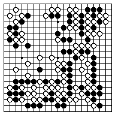
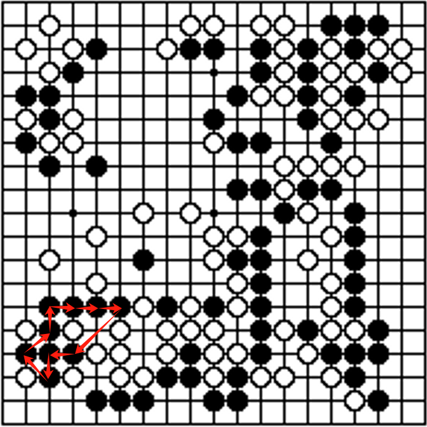

# Alpha Go

[TOC]

## Task: Go

### Rules of Go

#### Tromp-Taylor Rules

1. Go is played on a 19x19 square grid of points, by two players called Black and White.
1. Each point on the grid may be colored black, white or empty.
1. A point P, not colored C, is said to reach C, if there is a path of (vertically or horizontally) adjacent points of P’s color from P to a point of color C.
1. Clearing a color is the process of emptying all points of that color that don’t reach empty.
1. Starting with an empty grid, the players alternate turns, starting with Black.
1. A turn is either a pass; or a move that doesn’t repeat an earlier grid coloring.  
1. A move consists of coloring an empty point one’s own color; then clearing the opponent color, and then clearing one’s own color.
1. The game ends after two consecutive passes.
1. A player’s score is the number of points of her color, plus the number of empty points that reach only her color.
1. The player with the higher score at the end of the game is the winner. Equal scores result in a tie.

#### 中国围棋规则

1. 围棋的棋具
   - 棋盘。棋盘由纵横各19条等距离、垂直交叉的平行线构成。形成361个交叉点，简称为“点”。
   - 棋子。棋子分黑白两色。
1. 围棋的下法
   - 对局双方各执一色棋子。
   - 空枰开局。
   - 黑先白后，交替着一子于棋盘的点上。
   - 棋子下定后，不再向其他点移动。
   - 轮流下子是双方的权利，但允许任何一方放弃下子权而使用虚着。
1. 棋子的气。一个棋子在棋盘上，与它直线紧邻的空点是这个棋子的“气”。直线紧邻的点上如果有同色棋子存在，这些棋子就相互连接成一个不可分割的整体。直线紧邻的点上如果有异色棋子存在，此处的气便不存在。棋子如失去所有的气，就不能在棋盘上存在。
1. 提子。把无气之子清理出棋盘的手段叫“提子”。提子有二种：
   - 下子后，对方棋子无气，应立即提取对方无气之子。
   - 下子后，双方棋子都呈无气状态，应立即提取对方无气之子。
1. 禁着点。棋盘上的任何一点，如某方下子后，该子立即呈无气状态，同时又不能提取对方的棋子，这个点叫做“禁着点”。
1. 禁止全局同形。着子后不得使对方重复面临曾出现过的局面。
1. 终局
   - 棋局下到双方一致确认着子完毕时，为终局。
   - 对局中有一方中途认输时，为终局。
   - 双方连续使用虚着，为终局。
1. 活棋与死棋
   - 终局时，经双方确认，不能被提取的棋都是活棋。
   - 终局时，经双方确认，能被提取的棋都是死棋。
1. 计算胜负。着子完毕的棋局，采用数子法计算胜负。将双方死子清理出盘外后，对任意一方的活棋和活棋围住的点以子为单位进行计数。双方活棋之间的空点各得一半。棋盘总点数的一半180.5点为归本数。一方总得点数超过此数为胜，等于此数为和，小于此数为负。

### Board & Player & Color

$$
\begin{align*}
\boldsymbol B &\in \{0, 1, -1\}^{n \times n} \quad n = 19  \tag{Board}\\
b &\in \{1, 0, -1\} \tag{Color}
\end{align*}
$$

- Board: a 19x19 square grid of points 
- Player: by two players called Black and White. 
- Color: Each point on the grid may be colored black, white or empty. 

| Color | Number |
| :---: | :----: |
| Empty |   0    |
| Black |   1    |
| White |   -1   |

### State
$$
\begin{align*}
S &= (\boldsymbol B) \tag{State Set}\\
\boldsymbol B_0 &= \boldsymbol 0  \tag{空枰开局}
\end{align*}
$$

- $S_0$ Initial State
- $S_{\text{end}}$  Termination Status
> Starting with an empty grid.
> The game ends after two consecutive passes.

$$
a_{\text{end-1}} = a_{\text{end}} = \text{PASS}
$$

- **Player**: Indicates the current player's color, witch can be: (1) Black. (2) White.
- **Board**: Represents the game bord, modeled as an $n \times n$ matrix. Each element in the matrix can be one of the following:  (1) Black. (2) White. (3) Empty.
- **Action**: Refers to the available moves a player can take, which include:
  1. **PASS**: Skip the current turn.
  2. **Position on the Board**: Place a piece at a specific location on the board.
- **Connected Regions**: The records of the connected regions in the board, which modeled as closed loops.
  - **Connected Group Map**: A connectivity Map that assigns as an index to each connect group of the same color, identifying its territory. The index also corresponds to the head position of any closed loops within the group.
  - **Next Map**: A successor mapping used to identify the next piece in a connected group of the same color. This allows easy traversal of the entire connected region for the closed loops.
  - **Qi**: A mapping that records the number of liberties (open adjacent points) for each connected group's index.

- **History States**: A collection of all previous board states.

#### Reach
> A point P, not colored C, is said to reach C, if there is a path of (vertically or horizontally) adjacent points of P’s color from P to a point of color C.

$$
\text{adj}(x, y) = \{(x+1, y), (x, y+1), (x-1, y), (x, y-1)\}  \tag{adjacent}
$$

- **Stone Block**: Stone Block is consisted of adjecent stones of the same color.
  
- **Qi**: Qi is a number of empty points that a stone block can reach.

#### Terminate States

twice `PASS` to termination the game.

#### Zobrist Hash

$$
v = v \odot \text{table}_\text{Zobrist}(\text{position}, \text{color});
$$

Zobrist hashing is to efficiently compute unique hash values representing different board states. Zobrist Table, is a 2D array that holds precomputed random 64-bit numbers. Each entry in this table corresponds to a unique combination of a board position and a possible state. Compute the Zobrist Hash, compute the current hash value based on a change at a specific board position and color (state).
- **Adding a Piece**: XOR the hash with the random number corresponding to the `(position, state)` pair.
- **Removing a Piece**: XOR the hash again with the same random number, effectively removing its influence from the hash.

### Action

$$
\begin{align*}
\mathcal A &= \{(\text{PASS}, c)\} \cup \{(x, y, c) \ |\ x \in 1:n,\ y \in 1:n,\ c \in \{1, -1\},\ B(x, y) = 0\}  \tag{Action Set}\\
A_{0,c} &= 1  \tag{黑先白后}\\
A_{k,c} &= -A_{k-1,c}  \tag{交替落子}
\end{align*}
$$

- $A_0$ Initial Action

#### Pass

跳过该局

#### Disable global isomorphism

$$
\boldsymbol B_t \neq \boldsymbol B_{\tau}  \quad \forall 0 \le \tau \le t  \tag{disable global isomorphism}
$$

检查当前传入的状态 state 的棋盘的zobrist hash 值，是否在历史上同一棋手处存在过。

#### Not allow suicide

### State Transfer

$$
\begin{align*}
\boldsymbol B(a_{k,x}, a_{k,y}) &\gets a_{k,c}  \tag{空地落子}\\
\boldsymbol B((u_x, u_y) \ |\ Q(U) = 0, U_c \neq a_{k,c}) &\gets 0  \tag{无气提子}
\end{align*}
$$

#### Remove stone block with no Qi

输入要删除的连通块的序号，遍历块的颜色将其改为空点，并且将周围的块的气加一。

#### Merge stone block

输入两个连通块的序号，也是头位置，遍历块1的颜色都改为块2序号，并看周围空点是否为块1、2的共用空点，如果不是，块2的气加一. 最后交换两个头的后继，合并为1个连通块。

### Reward

> A player’s score is the number of points of her color, plus the number of empty points that reach only her color.
> The player with the larger score at the end of the game is the winner.

$$
\begin{align*}
R_{\text{Black}}(S) &= -R_{\text{White}}(S)  \tag{Zero-Sum Game}\\
R_{\text{Black}}(S) &= - \frac{7.5}{2} + \sum_{\begin{matrix}\tiny{(x, y) \in (1:n, 1:n)} \\ \tiny{\boldsymbol B(x, y) = 0}\end{matrix}}(x, y, S)  \tag{数子}\\
I_{\text{Black}}(x, y, S) &= \left\{\begin{matrix} c & c \in \text{reach}(x, y), -c \notin \text{reach}(x, y) \\ \frac{1}{2} & other.\end{matrix}\right.\\
\end{align*}
$$

#### Score: Number of spaces reachable

1. 函数`calculateReachColor`接收两个参数：一个颜色数组`board`和一个表示特定颜色的整数`color`。`BOARD_COLOR_NUM`是一个预定义的常量，表示`board`数组的大小。
2. `reachable`变量初始化为0，它用于记录可达的空格数量。
3. `bd`是一个布尔类型的向量，初始化所有元素为`false`，用于标记网格中的每个位置是否已经被访问过。
4. `open`是一个队列，用于进行宽度优先搜索（BFS）。
5. 第一个`for`循环遍历游戏板上的所有位置。如果某个位置的颜色与给定的颜色相同，这个位置就被认为是可达的，`reachable`会增加，相应的`bd`数组位置会被标记为`true`，并且该位置会被加入到`open`队列中。
6. 接下来的`while`循环是一个宽度优先搜索，用于找到所有从起始颜色出发可达的`EMPTY`（未被占据的）位置。这个循环会一直进行，直到没有更多的位置需要检查。
7. 在循环内部，它取出队列`open`的前端元素，代表当前正在检查的位置。
8. 接着，内部的`for`循环遍历该位置的四个相邻位置（由`adj_x`和`adj_y`数组给出的偏移量表示）。对于每个相邻位置，计算新的`xt`和`yt`坐标，以及`vt`，即该位置在`board`数组中的索引。
9. 如果计算出的相邻位置坐标在棋盘内，并且该位置未被访问过，同时位置颜色为`EMPTY`，则将其标记为已访问，并将该位置的索引加入到`open`队列中。
10. 最后，函数返回`reachable`的值，即从给定颜色出发，可以到达的`EMPTY`位置的总数。

#### Win or loss calculation (Komi)

**Komi** is a rule that provides an additional score to the player playing with the white stones to compensate for the advantage that the player with black stones has by playing the first move.

## Solution: Alpha-Go

### Architecture

### Policy-Value Network

The **Policy Network** predicts the probability distribution of actions to take at each state of the game. The output of policy network is a vector where each element represents the probability of taking a particular action.

The **Value Network** evaluates the board position by predicting the likelihood of winning from that position. The value network outputs a scalar value $\in [-1, 1]$, which represents the probability of winning from that state.

The policy network and value network are combined into a single deep convolutional neural network (CNN) called **Policy-Value Network**. 

- Input layer: The input is a 19x19 matrix with 17 channels, including the current state of the board, which player's turn it is (black or white),

- Policy Head: One branch of the network processes the features from the shared layers to produce the policy (the action probabilities).
- Value Head: Another branch processes the same features to produce the value (the game outcome evaluation).

### Monte Carlo Tree Search

**Selection**: During the tree search process, MCTS starts from the root node and selects a path until it reaches a node that has not been fully expanded or a leaf node. During the selection process, MCTS uses UCT (Upper Confidence Bound for Trees) to balance exploration and exploitation. 通过引入网络提供的策略概率来帮助计算节点选择的优先级, MCTS 在选择动作时偏向于那些网络预测为高概率的动作，从而加速了搜索过程。
$$
UCT = Q(s, a) + \frac{P(s, a) \sqrt{N(s)}}{1 + N(s)}
$$

- $Q(s, a)$: the average of state $s$ and action $a$ (obtained through simulation).
- $P(s, a)$: the policy probability given by the Policy Network (the probability distribution of the network output).
- $N(s)$: the number of visits to the current state $s$.

**Expansion**: When searching for a node that has not been fully expanded, MCTS generates a probability distribution of all legal actions for the node through the Policy Network and expands the tree based on these probabilities. Each expanded node represents a new state and initializes the number of visits and value of the state.

**Simulation**: After expansion, MCTS will perform a quick simulation (Rollout), starting from the newly expanded node, each step uses the strategy and evaluation value provided by the Policy-Value Network to select actions to simulate the entire game process until the game ends. The purpose of this stage is to quickly estimate the final result of the state through simulation. Value Network 负责为每个状态提供一个值估计（即这个局面的胜率）, 模拟（rollout）利用了 Value Network 来提供对当前局面的精确评估，而不是依赖在传统的 MCTS 中随机决策模拟来进行推演。这样，MCTS 在每次模拟结束时不仅仅依据游戏的最终结果来评估，还结合了网络对局面质量的估值，从而优化了搜索策略。

**Backpropagation**: Once the simulation is finished, MCTS will update the statistics of all nodes along the path based on the simulation results. The Q-value (i.e., the value of the node) of each node will be updated to the simulation result, and N(s) will increase by 1, indicating that the node has been visited once. This update process will continue until the root node. During the backtracking process, the evaluation value of the leaf node is updated using the Value Network to avoid relying entirely on the simulation results, and instead combine the accurate evaluation of the neural network to improve the search effect.

### Train

In AlphaGo Zero, the optimizer used is Adam Optimizer.

#### Loss function

$$
\begin{align*}
Loss_\text{total} &= Loss_\text{policy} + c \times Loss_\text{value}  \\
&= - \sum_{i} \pi_{\text{target}}(s) \log \pi_{\theta}(s) + c \times\left( V_{\text{target}}(s) - V_{\theta}(s) \right)^2
\end{align*}
$$

**Policy Loss** minimizes the difference between the network's output strategy $\pi_{\theta}(s)$ and the true strategy $\pi_{\text{target}}(s)$. It uses the **cross-entropy loss function**, which optimizes by calculating the difference between the strategy predicted by the network and the strategy obtained through MCTS. This loss function helps the network learn a strategy that aligns with the results of the MCTS search, guiding the model to choose more likely actions during the tree search.

**Value Loss** minimizes the difference between the network's predicted value $V_{\theta}(s)$ and the true value $V_{\text{target}}(s)$. It uses **mean squared error (MSE)** to measure the accuracy of the network's evaluation of the state. This loss function ensures that the network's output closely matches the true state evaluation, thus improving the model's ability to predict the value of a given state.

- $\pi_{\theta}(s)$: the predicted strategy of the network
- $\pi_{\text{target}}(s)$: the actual strategy calculated by MCTS
- $i$: each possible position on the board
- $V_{\theta}(s)$: the predicted value of the network
- $V_{\text{target}}(s)$: the actual value obtained by MCTS simulation (i.e. the winning rate of the current situation)
- $c$: a hyperparameter used to adjust the relative importance of policy loss and value loss, balancing the two and avoid one part having too much influence on the training process.