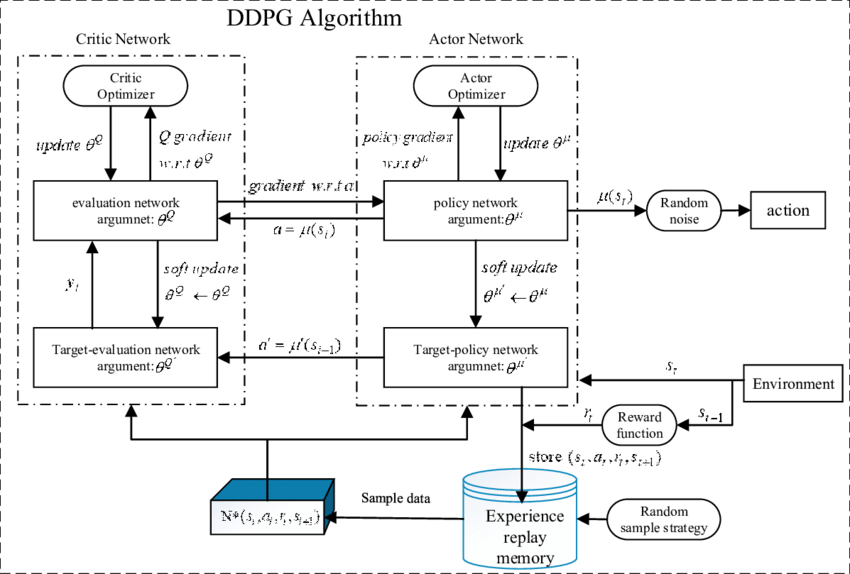

# Solving Algorithm of Markov Decision Process

[TOC]

## Value-Based methods: Estimate the Value function

For a Markov decision process, the value-based methods is to find the optimal policy indirectly by estimating the value function $V_\pi(s)$ of the policy $\pi$ of each state or state-action pair.

### Dynamic Programming: Iterative search for fixed points

$$
\begin{align*}
\hat V(s) &\leftarrow \max_{a \in A(s)} \left( R(s, a) + \gamma \sum_{s' \in S} \mathbb P(s' | s, a) \hat V(s') \right)  \tag{value iteration}\\
V_{\pi}(s) &= R(s, \pi(s)) + \gamma \sum_{s' \in S} \mathbb P(s' | s, \pi(s)) V_{\pi}(s') \tag{policy evaluation}\\
\pi'(s) &= \arg \max_{a \in A(s)} \left( R(s, a) + \gamma \sum_{s' \in S} \mathbb P(s' | s, a) V_{\pi}(s') \right)  \tag{policy improvement}
\end{align*}
$$

Dynamic programming (DP) is an optimization method that decomposes complex problems into simple sub-problems, suitable for decision-making problems with overlapping sub-problems and optimal sub-structures. Dynamic programming updates the state-value function $V(s)$ through value iteration or policy iteration to ultimately obtain an optimal strategy.

- **Value Iteration**: The value functions $\hat V(s)$ are updated iteratively until they converge to the optimal value function $V(s)$, and its convergence can be guaranteed by the Bellman equation. Specifically, value iteration start with an initial guess $\hat V^{(0)}(s)$ and the iteration stops when $|\hat V^{\text{new}}(s) - \hat V^{\text{old}}(s)| < \epsilon, \forall s \in S$. The value iteration does not need to explicitly maintain a policy, but finds the optimal policy by directly calculating the optimal value function for each state.
- **Policy Iteration**: The optimal strategy is gradually approached by alternating policy evaluation and policy improvement. Policy evaluation uses the Bellman equation and DP to iteratively update to approximate the value function $V_\pi(s)$ under the current policy $\pi$. Policy improvement updates the strategy greedily based on $V_\pi(s)$ to find the optimal action as the new strategy in each state.

### Monte Carlo Method: Random sampling estimation

$$
V_\pi (s) = \mathbb E \left(\sum_{t=0}^T \gamma^t R_t \ |\ S_0 = s, \pi \right)
$$

Monte Carlo method is used to estimate statistical distributions through large-scale random sampling, without knowing environmental information such as the transition probability $\mathbb P(s', r | s, a)$. Specifically, we randomly sample a large number of complete paths $\left\{G_{\pi, s}^{(1)}, G_{\pi, s}^{(2)}, \cdots \right\}$ starting from state $s$ and then calculate their expectations to estimate the value function $V_\pi(s)$ of following policy $\pi$.
$$
\hat V_\pi(s) \gets \hat V_\pi(s) + \alpha \left(G_{\pi, s}^{(i)} - \hat V_\pi(s)\right)  \tag{sequential update}
$$

In the specific implementation, the sequential update method can be used. 

- $\hat V_\pi(s)$: estimation of the value function.
- $G_t$: the cumulative reward sample value after a complete sampling from state $s$ to the termination.
- $\alpha$: learning rate, controls how much new information updates the current estimate.

### Temporal Difference Learning

$$
\begin{align*}
V_\pi(s)  &\gets V_\pi(s) + \alpha (r + \gamma V_\pi(s') - V_\pi(s)) 
\end{align*}
$$

Temporal Difference Learning updates the value function at each time step based on partial raw experience without requiring a model of the environment. TD learning enables immediate feedback without needing to estimate the value function at the end of a complete path like Monte Carlo sampling.

- On-policy (Behavior Policy $=$ Target Policy): Learn the value function and improve the policy based on the agent's current behavior policy. The policy used to generate experience (behavior policy) is the same as the policy being optimized (target policy).
- Off-policy (Behavior Policy $\neq$ Target Policy): Learn the value function for the target policy while following a different behavior policy to generate experience. The behavior policy is typically more exploratory, while the target policy can focus on exploitation or be deterministic.

#### Q-learning

$$
\begin{align*}
Q(s_t, a_t) &\leftarrow Q(s_t, a_t) + \alpha (r_{t} + \gamma \max_{a' \in A} Q(s_{t+1}, a) - Q(s_t, a_t))  \tag{Q-learning}\\
Q(s_t, a_t) &\leftarrow Q(s_t, a_t) + \alpha (r_{t} + \gamma Q(s_{t+1}, a_{t+1}) - Q(s_t, a_t))  \tag{Sarsa}
\end{align*}
$$

Q-learning aims to directly estimate the optimal state-action value function $Q(s, a)$ without the dynamic transition probability of the environment. State-Action-Reward-State-Action (SARSA) is an on-policy algorithm and Q-learning is a off-policy algorithm.

Deep Q-Networks (Q-learning + Neural networks) employs a neural network to approximate the $Q(s, a)$ instead of using a Q-table.

## Policy-Based methods: Direct search the optimal policy

Policy-Based methods directly learn a policy and optimize the policy itself. Specifically, they estimate the probability distribution of selecting a particular action given a state.

### Policy Gradient Ascent Method

$$
\begin{align*}
\mathbb P_\pi (a | s, \theta)  \\
\theta_{t+1} = \theta_{t+1} + \alpha \widehat{\nabla J(\theta_t)}
\end{align*}
$$

Policy Gradient Ascent Method update the parameters $\theta$ of the stochastic policy through policy gradient ascent. 

- $J(\theta)$ is the performance measurement function of the policy, which can be defined as $J(\theta) = V_{\pi_\theta} (s_{t=0})$.

### Policy gradient theorem  

$$
\begin{align*}
\nabla J(\boldsymbol \theta) &= \nabla_\theta V(s)  \\
&\propto \sum_{s' \in S} \mathbb P_{μ,\pi}(s') \sum_{a \in A} Q_\pi(s', a) \nabla_\theta \mathbb P_\pi(a | s', \boldsymbol \theta)   \\
&\propto \mathbb E_{s' \sim \mathbb P_{μ,\pi}, a \sim \pi}(Q_\pi(s', a) \nabla_\theta \ln \mathbb P_\pi (a | s'))
\end{align*}
$$

Strategy gradient theorem describes how to compute the gradient of the expected cumulative reward with respect to the parameters of a stochastic policy. 

### Policy Gradient

## Comprehensive methods

### Actor-Critic

The Actor-Critic algorithm combines the policy-based and value-based methods.

- **Actor**: proposes actions given the current state. The actor is essentially the policy $\pi(a|s)$ of the agent, which can be either deterministic or stochastic. It's responsible for the actual decision-making process.
- **Critic**: The critic evaluates the actions taken by the actor by computing the value function $V(s)$ or the action-value function $Q(s, a)$. The critic assesses the quality of the actions given the state of the environment.

**Policy (Actor) Improvement**: The actor adjusts its policy parameters $\theta$ based on the gradient of expected rewards. It tries to maximize the expected return by considering the feedback from the critic.

**Value Function (Critic) Estimation**: The critic updates the value function parameters $w$ to more accurately predict the expected return. The difference between the predicted return and the actual return (the temporal difference error, $\delta$) is used to improve the policy.

**Temporal Difference (TD) Error**: This is a key concept in actor-critic algorithms. The TD error $\delta$ is calculated by the critic and represents the difference between the predicted reward from the current state-action pair and the reward received plus the predicted reward from the next state. The TD error is then used to update both the actor and the critic.

**Advantages**: Actor-critic methods aim to combine the advantages of both policy-based and value-based approaches. The critic's value function helps reduce the variance of the policy gradient, leading to more stable and efficient learning than policy-based methods alone. At the same time, because the actor maintains an explicit policy, it can be easier to learn and more effective in high-dimensional or continuous action spaces compared to value-based methods.

**Variants**: There are many variants of the actor-critic algorithm, including A3C (Asynchronous Advantage Actor-Critic), A2C (Advantage Actor-Critic), and SAC (Soft Actor-Critic), each with its own improvements and optimizations for different scenarios.

### Deep Deterministic Policy Gradient

Deep Deterministic Policy Gradient (DDPG) is a model-free, off-policy actor-critic algorithm that specifically addresses environments with continuous action spaces.

### Asynchronous Advantage Actor-Critic (A3C)
