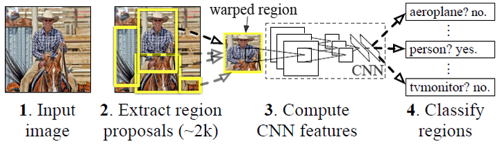

# Region-based convolution nerual network (RCNN)

1. 候选区域生成： 一张图像生成1K~2K个候选区域 （采用Selective Search 方法）
2. 特征提取： 对每个候选区域，使用深度卷积网络提取特征 （CNN）
3. 类别判断： 特征送入每一类的SVM 分类器，判别是否属于该类
4. 位置精修： 使用回归器精细修正候选框位置

非极大值抑制（NMS）：

就像上面的图片一样，定位一个车辆，最后算法就找出了一堆的方框，我们需要判别哪些矩形框是没用的。非极大值抑制的方法是：先假设有6个矩形框，根据分类器的类别分类概率做排序，假设从小到大属于车辆的概率 分别为A、B、C、D、E、F。

(1)从最大概率矩形框F开始，分别判断A~E与F的重叠度IOU是否大于某个设定的阈值;

(2)假设B、D与F的重叠度超过阈值，那么就扔掉B、D；并标记第一个矩形框F，是我们保留下来的。

(3)从剩下的矩形框A、C、E中，选择概率最大的E，然后判断E与A、C的重叠度，重叠度大于一定的阈值，那么就扔掉；并标记E是我们保留下来的第二个矩形框。

就这样一直重复，找到所有被保留下来的矩形框。
