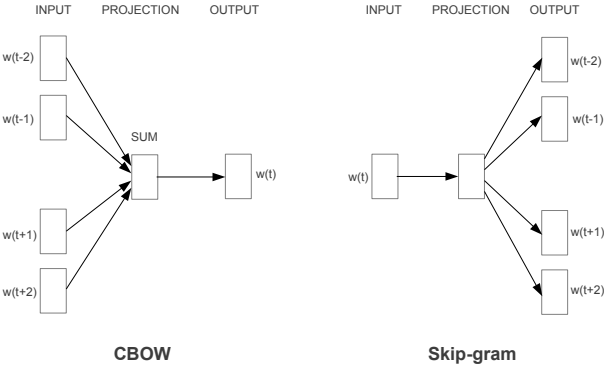

# Word2Vec

[TOC]

## Define

$$
word \to \mathbb R^n
$$

Word2Vec is a technique used to represent words as continuous vectors, which can capture the semantic relationships between words.

### CBOW（Continuous Bag of Words）

CBOW模型的思想是根据上下文中的词语来预测目标词语。具体步骤如下：

1. 建立一个包含所有词汇的词汇表，并为每个词语分配一个唯一的索引。
2. 定义一个固定维度的向量空间，每个词语都映射到这个空间中。
3. 对于每个训练样本，选择一个目标词语和其上下文词语，将上下文词语的词向量取平均作为输入，然后通过一个神经网络模型来预测目标词语。
4. 使用损失函数（通常是交叉熵）来衡量预测词语和真实目标词语之间的差距，然后通过梯度下降算法来更新词向量，使得损失最小化。

### Skip-gram

Skip-gram模型的思想是根据目标词语来预测上下文词语。具体步骤如下：

1. 建立一个包含所有词汇的词汇表，并为每个词语分配一个唯一的索引。
2. 定义一个固定维度的向量空间，每个词语都映射到这个空间中。
3. 对于每个训练样本，选择一个目标词语，然后通过一个神经网络模型来预测该词语的上下文词语。
4. 使用损失函数来衡量预测上下文词语和真实上下文词语之间的差距，然后通过梯度下降算法来更新词向量，使得损失最小化。

## Process

1. 每个词首先被转换成一个 one-hot encoding

2. 权重矩阵:Word2Vec模型有两个权重矩阵，分别是输入层到隐藏层的权重矩阵$W$和隐藏层到输出层的权重矩阵$W'$。对于一个词汇量大小为$V$的语料库和$N$维的隐藏层，$W$是一个$V \times N$的矩阵，$W'$是一个$N \times V$的矩阵。

3. 训练目标:对于CBOW模型，训练的目标是最大化某个特定词的条件概率，这个条件概率是基于它的上下文。对于Skip-gram模型，目标是最大化上下文中每个词的条件概率，这些概率是基于当前的目标词。

4. 概率计算:这些条件概率通常使用softmax函数来计算。例如，在Skip-gram模型中，给定当前词$w_t$的情况下，上下文词$w_c$的概率可以表示为：
$$
P(w_c | w_t) = \frac{e^{w'_{c} \cdot w_t}}{\sum_{i=1}^{V} e^{w'_{i} \cdot w_t}}
$$
其中$w'_{c}$是权重矩阵$W'$中与上下文词$w_c$对应的向量，$w_t$是权重矩阵$W$中与目标词$w_t$对应的向量。

5. 优化:Word2Vec使用随机梯度下降（SGD）来调整权重矩阵，以最大化上述条件概率的对数似然。这通常涉及到对每个训练样本计算输出概率与实际概率之间的差异，并据此更新权重。

6. 负采样: 因为softmax函数的分母包含对整个词汇的遍历，这在计算上是非常昂贵的。为了解决这个问题，Word2Vec引入了负采样。这种方法不是在每次更新时都对所有的词汇进行遍历，而是随机选择一小部分“负”词来更新权重。这显著减少了计算复杂性。

