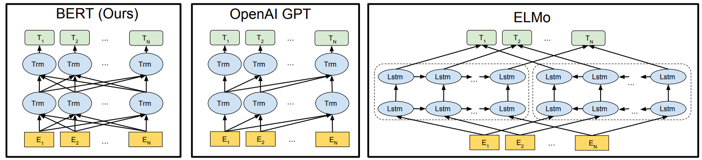
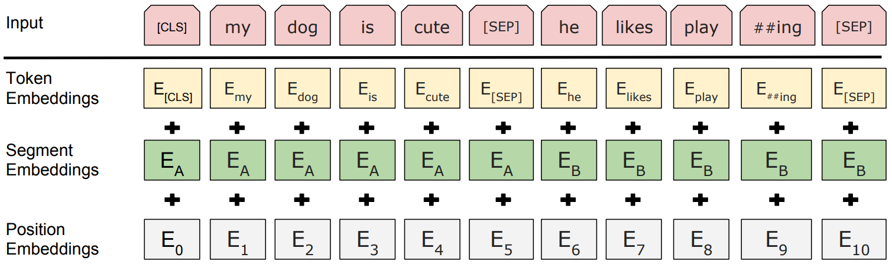
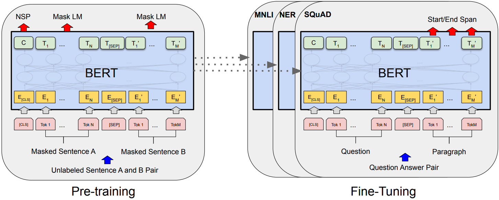

# Bidirectional Encoder Representations from Transformers

[TOC]

## Architecture

**Bidirectional Encoder Representations from Transformers (BERT)** is a transformer-based model designed for natural language understanding. BERT is based on the transformer encoder architecture. BERT consists of multiple encoder layers (e.g., 12 for BERT-base, 24 for BERT-large).

**Bidirectional Context**: Unlike earlier models like GPT, which processed text in a unidirectional manner (left-to-right or right-to-left), BERT reads text bidirectionally. This allows the model to consider both preceding and succeeding words simultaneously, providing deeper context for word representations.

### Input Representation

[CLS] stands for "classification" token, it is a special token added at the very beginning of every input sequence. [SEP] stands for "separator" token, it is used to indicate the boundary between two segments (e.g., two sentences) or the end of a single sentence.

- **Token Embedding**: Each token in the input text is mapped to a fixed-dimensional vector using an embedding layer, and use WordPiece tokenization to split words into smaller subword units. 
- **Segment Embedding**: Distinguishes between multiple input segments (e.g., sentence pairs) when using tasks like Next Sentence Prediction. Each token is assigned a segment ID depending on which segment it belongs to, these segment IDs are mapped to segment embeddings (learned during training).
- **Positional Embedding**: Provides information about the position of tokens in the sequence, as transformers process input tokens simultaneously without inherent order information.

### Pre-training & Fine-tuned

BERT is pre-trained on large corpora (e.g., Wikipedia, BooksCorpus) and fine-tuned on specific downstream tasks (e.g., question answering, text classification) with task-specific data.

BERT is pre-trained using two novel tasks:

- **Masked Language Modeling (MLM)**: Randomly masks some tokens in the input and trains the model to predict the masked tokens based on their context.
- **Next Sentence Prediction (NSP)**: Trains the model to predict whether one sentence follows another in a coherent text.

