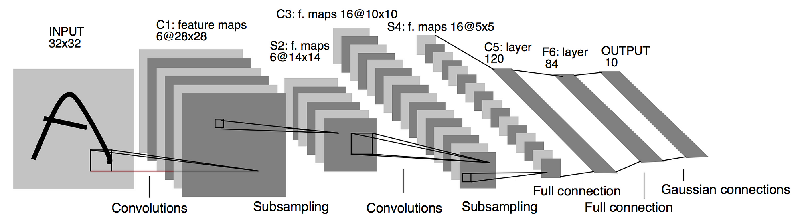

# Convolution Neural Network

[TOC]

## Architecture

A Convolutional Neural Network (CNN) is a neural network designed to process data with a grid-like structure, such as images or time-series data.

- $\boldsymbol X \in \mathbb R^{H \times W \times C}$: The input multidimensional array (image) of CNN.
- $H$: The height of the image.
- $W$: The width of the image.
- $C$: The channels of the image.

These steps are repeated across layers to learn hierarchical features, ultimately leading to the network's ability to classify or predict based on input data.

1. **Convolution:** $X * K$
2. **Activation:** $A(i, j) = \text{ReLU}(X * K + b)$
3. **Pooling:** $P(i, j) = \max(\text{pooling window})$
4. **Fully Connected:** $y = W x + b$
5. **Softmax (for classification):** $\text{softmax}(z_j)$

### Convolution Operation & Activation

$$
\begin{align*}
  x * k &= \left(y_{ij} \ |\ y_{ij} = \sum_{c=1}^{C_x} \sum_{p=1}^{H_x} \sum_{q=1}^{W_x} x_{c,i+p-1,j+q-1} × k_{cpq}\right)  \\
  y_c &= \text{ReLU}(x * k_c + b_c)  \\
  y &= \text{Concat}(y_1, y_2, ... , y_n)  \\
\end{align*}
$$

The core operation in a CNN is the convolution operation, which applies a filter (or kernel) to the input image or feature map. After the convolution operation, a non-linear activation function (usually ReLU) is applied to introduce non-linearity to the model.

- $*$ denotes the convolution operation, which involves sliding the filter over the image and computing element-wise multiplication followed by summation.
- $b$ is the bias term.

### Pooling Operation

$$
P(i, j) = \max\left(F(2i, 2j), F(2i+1, 2j), F(2i, 2j+1), F(2i+1, 2j+1)\right)  \tag{max pooling}
$$

Pooling layers are used to reduce the spatial dimensions of the feature maps, typically by applying max pooling or average pooling. 

- $F$ is the feature map after activation.

### Fully Connected Layer

$$
y = W \cdot x + b
$$

After multiple convolution and pooling layers, the CNN typically flattens the feature maps into a 1D vector and feeds it into a fully connected (dense) layer. 
- $x$ is the flattened input vector.
- $W$ is the weight matrix of the fully connected layer.
- $b$ is the bias vector.
- $y$ is the output of the fully connected layer (which is then passed through an activation function, such as softmax for classification tasks).

### Back Propagation
$$
\begin{align*}
  \frac{∂E}{∂y_l} &= \frac{∂E}{∂y_L}·\frac{∂y_L}{∂y{L-1}}· ... ·\frac{∂y_{l+1}}{∂y_l}  \\
  &= δ_l \\
  &= δ_{l+1}·\frac{∂y_{l+1}}{∂x_{l+1}} \\
  &= δ_{l+1} * Rot_{π}(w_l)  \\
  \frac{∂E}{∂k_l} 
  &= \frac{∂E}{∂y_l} · \frac{∂y_l}{∂k_l} \\
  &= δ_l·\frac{∂y_l}{∂k_l}  \\
  &= δ_l * x_l  \\
  \frac{∂E}{∂b_l} &= δ_l · \frac{∂y_l}{∂b_l} = \sum_x \sum_y δ_l
\end{align*}
$$
$$
\begin{align*}
  \frac{∂y_{lcij}}{∂k_{lcpq}} &= x_{l,c,i+p-1,j+q-1}  \\
  \frac{∂y_{lc}}{∂k_{lcpq}} &= \sum_{i=1}^{H_y} \sum_{j=1}^{W_y} x_{l,c,i+p-1,j+q-1}  \\
  \frac{∂E}{∂k_{lcpq}} &= \sum_{i=1}^{H_y} \sum_{j=1}^{W_y} δ_{lcij} × x_{l,c,i+p-1,j+q-1}  \\
  &= δ_{lc} * x_{lc}  \\
  \frac{∂E}{∂b_{lc}} &= \sum_{i=1}^{H_y} \sum_{j=1}^{W_y} δ_{lcij} = \sum_x \sum_y δ_l
\end{align*}
$$

