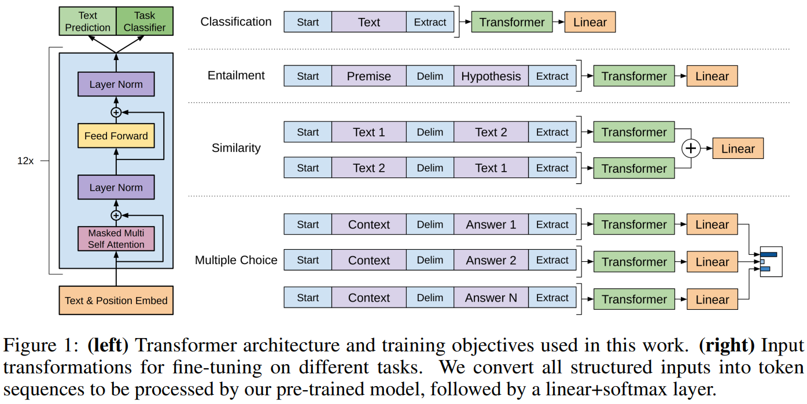

# Generative pre-trained transformer

[TOC]

## Architecture

A **Generative Pre-trained Transformer (GPT)** is a type of neural network model designed for natural language processing (NLP) tasks. GPT models are based on the Transformer architecture and are trained using large-scale datasets to predict the next word or token in a sequence, enabling them to generate coherent and contextually relevant text.

### Input Representation

- **Tokenization**: Inputs are tokenized into subword units (e.g., using Byte Pair Encoding or a similar tokenizer).

- **Embedding Layer**: Each token is mapped to a fixed-dimensional vector using a learned embedding matrix.

- **Positional Encoding**: As Transformers lack intrinsic sequence order awareness, positional encodings (fixed or learned) are added to token embeddings to encode positional information.

### Multi-Layer Transformer Decoder

GPT stacks multiple Transformer decoder layers. Each layer consists of Masked Multi-Head Self-Attention, Feedforward Neural Network (FFN), Residual Connections, Layer Normalization.

### Generative Pre-Training & Fine-Tuning

**Generative Pre-Training**: Pre-trained on vast amounts of text data in an unsupervised manner. Learns language structure, grammar, and context during pre-training.

**Fine-Tuning**: After pre-training, the model can be fine-tuned for specific tasks (e.g., summarization, question answering, or translation).

### Training

$$
\mathcal{L} = -\sum_{t=1}^{N} \log P(x_t \mid x_{1:t-1}; \theta)
$$

GPT is trained using the autoregressive language modeling objective.

- $x_t$ is the current token
- $x_{1:t-1}$ are prior tokens
- $\theta$ are the model parameters.