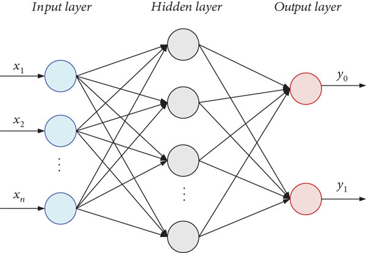

# Neural Network

[TOC]

## Architecture

$$
\boldsymbol y = σ (\boldsymbol W \boldsymbol x + \boldsymbol b)  \tag{Forward Propagation} \\
\boldsymbol{y} = \sigma_L(\boldsymbol{W_L} \sigma_{L-1}(\dots \sigma_1(\boldsymbol{W_1} \boldsymbol{x} + \boldsymbol{b_1}) \dots + \boldsymbol{b_L}))
$$

Neural networks consist of interconnected layers of neurons (or units) that process data and learn to make predictions or decisions based on input data. A neuron computes the linear combination $\boldsymbol{w} \boldsymbol{x} + \boldsymbol{b}$, and then passed through an **activation function** $\sigma$, which transforms the output to a range that depends on the type of activation function used. This output $\boldsymbol{y}$ is typically the input to the next layer in a deep neural network.

- $\boldsymbol{y}$: The output of the neuron or unit (can be a scalar or vector depending on the network architecture).
- $\boldsymbol{x}$: The input to the neuron (a vector of features or activations from the previous layer).
- $\boldsymbol{W}$: The weights associated with each input feature. It’s a vector (or matrix in the case of multi-dimensional inputs) that determines the strength of the connection between the input and the output.
- $\boldsymbol{b}$: The bias term. It is a scalar (or vector, depending on the layer) that helps the model adjust the output independently of the input, allowing for better fitting of data.
- $\sigma$: The **activation function**, which introduces non-linearity into the model. It could be any function such as the sigmoid, ReLU (Rectified Linear Unit), tanh, softmax, etc. The purpose of $\sigma$ is to map the weighted sum of the inputs to a desired output range and to allow the model to learn non-linear relationships in the data.
- $\boldsymbol{w} \boldsymbol{x} + \boldsymbol{b}$: Linear Combination.

Neural networks are typically organized into layers: 
 - **Input Layer**: Takes the raw data as input (features of the data).
 - **Hidden Layers**: Intermediate layers where computations are performed to learn features from the input. There can be multiple hidden layers in deep networks (Deep Neural Networks, or DNNs).
 - **Output Layer**: Produces the final prediction or classification.

### Activation Function

An activation function introduces non-linearity into the network, enabling it to learn more complex patterns. Common activation functions include:
- **Sigmoid**: $\sigma(z) = \frac{1}{1 + e^{-z}} \), used for binary classification.
- **ReLU**: $\sigma(z) = \max(0, z) \), used in hidden layers.
- **Tanh**: $\sigma(z) = \frac{e^z - e^{-z}}{e^z + e^{-z}} \), output range between -1 and 1.
- **Softmax**: Converts logits into a probability distribution over multiple classes (used in multi-class classification problems).

## Train

### Back Propagation: Gradient Descent Optimization

$$
\begin{align*}
  δ_l &= (\boldsymbol w_{l+1}^T·δ_{l+1})·σ'(z_l)  \tag{每层误差}  \\
  δ_L &= ∇ E · σ'(z_{outl})  \tag{输出层误差}  \\
  ∇ E(\boldsymbol w_l) &= δ_l \boldsymbol x_l^T  \tag{每层参数误差}  \\
\end{align*}
$$

$$
\boldsymbol w^{τ+1} \leftarrow \boldsymbol w^τ - η ∇ E(\boldsymbol w^τ)
$$
Backpropagation Neural Network is a neural network trained by backpropagation algorithm. Backpropagation is the algorithm used to train the neural network by updating the weights and biases. It computes the gradient of the loss function with respect to each weight using the chain rule of calculus. The weights are updated using an optimization algorithm like **Stochastic Gradient Descent (SGD)** or more advanced ones like **Adaptive Moment Estimation (Adam)**.
- $z = \boldsymbol w^T \boldsymbol x + \boldsymbol b$
- $E_{total} = \sum (target_i - out_i)^2$ 误差·损失函数
- $E(\boldsymbol w)=\frac{1}{2} \sum_{n=1}^N ||\boldsymbol y(\boldsymbol x_n, \boldsymbol w)-\boldsymbol t_n||^2$

###  Optimization algorithm

#### Adaptive Moment Estimation

### Loss Function

The loss function is used to measure the error between the predicted output of the network and the true output (label). Common loss functions include Mean Squared Error (MSE), Cross-Entropy Loss. The objective during training is to minimize this loss function.

#### Cross Entropy Loss

$$
\text{Loss} = - \sum_{i=1}^{C} y_i \log(p_i)
$$

Cross-entropy loss 's behavior is more sensitive to incorrect predictions when the model is confident. In multi-class classification, the cross-entropy loss compares the predicted probabilities with the true label's one-hot encoded vector.

- $C$ is the number of classes,
- $y_i$ is the true probability distribution (one-hot encoded, where the true class label is 1, and others are 0),
- $p_i$ is the predicted probability for class $i$,
- The sum is taken over all classes $C$.

## Appendix

### Proof of Back Propagation Neural Network
每层参数误差, 由链式法则得(其中$L$指输出层),
$$
\begin{align*}
  \frac{∂ E}{∂ w_l} &= \frac{∂ z_l}{∂ w_l} \left(\frac{∂ y_l}{∂ z_l}\frac{∂ z_l}{∂ y_{l+1}}\right) ... \left(\frac{∂ y_{L-1}}{∂ z_{L-1}} \frac{∂ z_{L-1}}{∂ y_L} \right) \frac{∂ y_L}{∂ z_L} \frac{∂ E}{∂ y_L}  \\
  &= \frac{∂ z_l}{∂ w_l}  \left(\prod_{i = l}^{L} \frac{∂ y_i}{∂ z_i}\frac{∂ z_i}{∂ y_{i+1}} \right) \frac{∂ y_L}{∂ z_L} \frac{∂ E}{∂ y_L}  \\
\end{align*}
$$
其中,
$$
\begin{align*}
  \frac{∂ y_l}{∂ z_l} &= σ'(z_l)  \\
  \frac{∂ z_l}{∂ y_{l+1}} &= \boldsymbol w_{l+1}^T  \\
\end{align*}
$$
令$δ_l$为每层误差,
$$
\begin{align*}
  δ_l &=\left(\prod_{i = l}^{L} \frac{∂ y_i}{∂ z_i}\frac{∂ z_i}{∂ y_{i+1}} \right) \frac{∂ y_L}{∂ z_L} \frac{∂ E}{∂ y_L}  \\
  &= \left(\prod_{i = l}^{L} σ'(z_i)\boldsymbol w_{i+1}^T\right) σ '(z_L)\frac{∂ E}{∂ y_L}  \\
\end{align*}
$$
得到每层参数误差结果,
$$
\begin{align*}
  \Rightarrow \frac{∂ E}{∂ w_l} &= δ_l \frac{∂ z_l}{∂ w_l} = δ_l x_l^T  \\
  δ_L &= \frac{∂ E}{∂ y_L} ·σ '(z_L)  \\
\end{align*}
$$

