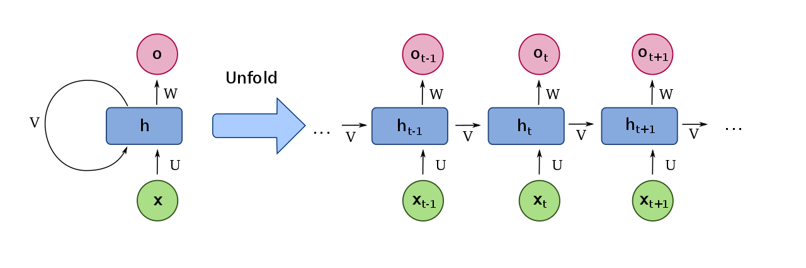

# Recurrent Neural Network

[TOC]

## Architecture

$$
\boldsymbol Y_{(\dim_y \times T_\text{seq})} = f(\boldsymbol X_{(\dim_x \times T_\text{seq})})  \tag{RNN}
$$
$$
(\boldsymbol y_t, \boldsymbol h_t) = f_\text{cell}(\boldsymbol x_t, \boldsymbol h_{t-1})  \tag{RNN Cell}
$$
Recurrent Neural Network is a model aimed to mine time information for a given time series $X \in \mathbb R^{\dim_x \times T_\text{seq}}$. We sequentially calculate the output vector $\boldsymbol y_t$ and hidden vector $\boldsymbol h_t$ at each time step $t$ by applying the function $f_\text{cell}(\cdot)$ to the input vector $\boldsymbol x_t$, starting from the beginning of the time series and continuing until the end.

In some scenarios, we can just select the last element $y_{:, T_\text{seq}}$ of sequence $Y$ as output.

## Include

### Long Short Term Memory

LSTM is a model of recurrent neural networks aims to process a given input time series $\boldsymbol X \in \mathbb R^{\dim_x \times T_{seq}}$ and output a time series $\boldsymbol Y = \boldsymbol H \in \mathbb R^{\dim_x \times T_{seq}}$. In some scenarios, we can select the last element $\boldsymbol h_{T_{seq}}$ of the sequence $\boldsymbol H$ as the output. We sequentially calculate hidden vector $\boldsymbol h_t$ and cell state $\boldsymbol c_t$ at each time step $t$ by applying the cell of LSTM $f_\text{cell}(\cdot)$  to the input vector $\boldsymbol x_t$, starting from the beginning of the time series and continuing until the end. 

$$
(h_t, c_t) = f_\text{cell}(x_t, h_{t-1}, c_{t-1})  \tag{LSTM cell}
$$

For each moment $t$, the architecture of the cell in LSTM is,
$$
\begin{align*}
  f_t &= \text{sigmoid}\left(W_f \left(\begin{matrix} h_{t-1} \\ x_t \end{matrix}\right) + b_f\right)  \tag{forget gate}\\
  i_t &= \text{sigmoid}\left(W_i \left(\begin{matrix} h_{t-1} \\ x_t \end{matrix}\right) + b_i\right)  \tag{input gate}\\
  o_t &= \text{sigmoid}\left(W_o \left(\begin{matrix} h_{t-1} \\ x_t \end{matrix}\right) + b_o\right)  \tag{output gate}\\
  g_t &= \text{tanh}\ \ \ \ \ \left(W_g \left(\begin{matrix} h_{t-1} \\ x_t \end{matrix}\right) + b_g\right)  \tag{cell input}\\
  c_t &= f_t \odot c_{t-1} + i_t \odot g_t  \tag{cell state}\\
  h_t &= o_t \odot \text{tanh}(c_t)  \tag{hidden state}
\end{align*}
$$

- **Input gate**: This gate determines which information from the current input should be stored in the cell state. It takes the current input and the previous hidden state as inputs, applies a $sigmoid$ activation function to them, and outputs a value $i_t$ between $0$ and $1$ for each input feature. A value of $1$ indicates that the feature is important and should be kept, while a value of $0$ means it should be discarded.

- **Forget gate**: This gate determines which information from the previous cell state should be forgotten or kept. It takes the previous hidden state and the previous cell state as inputs, applies a $sigmoid$ activation function to them, and outputs a value $f_t$ between $0$ and $1$ for each feature in the cell state. A value of $1$ indicates that the feature should be kept, while a value of $0$ means it should be forgotten.
- **Cell state**: This is the memory of the LSTM. It stores information over time and is modified by the input and forget gates. The input gate determines which new information should be added to the cell state, while the forget gate determines which information should be removed.
- **Output gate**: This gate determines which information from the current cell state should be outputted as the hidden state. It takes the current input and the current cell state as inputs, applies a $sigmoid$ activation function to them, and outputs a value $o_t$ between $0$ and $1$ for each feature in the cell state. It then applies a $tanh$ activation function to the current cell state and multiplies it by the output gate values to produce the current hidden state.

$$
\begin{align*}  
  \Rightarrow\quad  \left(\begin{matrix} \tilde f_t \\ \tilde i_t \\ \tilde o_t \\ \tilde g_t \end{matrix}\right)  
  &= W \left(\begin{matrix} h_{t-1} \\ x_t \end{matrix}\right) + b  \\
  &= W_h h_{t-1} + W_x x_t + b \\
  \left(\begin{matrix} f_t \\ i_t \\ o_t \end{matrix}\right) &= \text{sigmoid}\left(\left(\begin{matrix} \tilde f_t \\ \tilde i_t \\ \tilde o_t \end{matrix}\right)\right) \\
  g_t &= \text{tanh} (\tilde g_t) 
\end{align*}  
$$

|Symbols|Mean|
|---|---|
|$X \in \mathbb R^{\dim_x \times T_{seq}}, x_t \in \mathbb R^{\dim_x}$| input time series; element $x$ at time $t$|
|$H \in \mathbb R^{\dim_h \times T_{seq}}$| output time series consists of hidden states|
|$f_t \in (0,1)^{\dim_h}$| forget gate|
|$i_t \in (0,1)^{\dim_h}$| input gate|
|$o_t \in (0,1)^{\dim_h}$| output gate|
|$g_t \in (-1,1)^{\dim_h}$| cell input|
|$c_t \in \mathbb R^{\dim_h}$| cell state|
|$h_t \in \mathbb R^{\dim_h}$| hidden state|
|$\odot$| Hadamard product, multiply by element|
|$W \in \mathbb R^{4 \dim_h \times (\dim_h + \dim_x)}$|Weights|
|$W_{g/f/i/o} \in \mathbb R^{\dim_h \times (\dim_h + \dim_x)}$| Weights|
|$W_{h} \in \mathbb R^{4 \dim_h \times \dim_h}$| Weights|
|$W_{x} \in \mathbb R^{4 \dim_h \times \dim_x}$| Weights|

- Back Propagation:   
  $$
  \begin{align*}
    \Delta_{f, t} &= c_{t-1} · \Delta_{c, t-1} · \text{sigmoid}'(f_t)  \\
    \Delta_{i, t} &= g_t · \Delta_{c, t-1} · \text{sigmoid}'(i_t)  \\
    \Delta_{o, t} &= s_t · \Delta_{h_{t+1}, t} · \text{sigmoid}'(o_t)  \\
    \Delta_{g, t} &= i_t · \Delta_{c, t-1} · \text{tanh}'(g_t)  \\
  
    \Delta_{W_{fiog}, t} &= \Delta_{W_{fiog}, t - 1} + \Delta_{fiog, t} \times {x_c}^T  \\
    \Delta_{b_{fiog}, t} &= \Delta_{b_{fiog}, t - 1} + \Delta_{fiog, t}  \\
  
    \Delta_{c, t} &= o_t · \Delta_{h_{t+1}} + \Delta_{c_{t+1}}  \\
    \Delta_{h, t} &= \Delta_{x_c} [\Delta_{x, t}, \Delta_{h, t}]  \\
    \Delta_{x_c, t} &= \sum W^T \times \Delta_{fiog, t}  \\
  \end{align*}
  $$

### Gate Recurrent Unit
- Input: a time series $x \in \mathbb R^{\dim_x \times T_{seq}}$  
- Output: a time series $h \in \mathbb R^{\dim_x \times T_{seq}}, h = \{h_1, ...,h_{T_{seq}}\}$. Sometimes, we can take a part or the last element $h_{T_{seq}}$ of the sequence $h$ as the output.  
- Hyperparameter: the dimension of hidden state $h_t$: $\dim_h$

For a moment $t$, the define of the cell of GRU:
$$
h_t = f_{Cell}(x_t, h_{t-1})  \tag{a cell of GRU in moment $t$}
$$

$$
\begin{align*}
  \left(\begin{matrix} z_t \\ r_t\end{matrix}\right) &= \text{sigmoid}\left(W_{rz} \left(\begin{matrix} h_{t-1} \\ x_t \end{matrix}\right) + b_{rz}\right)  \tag{reset \& input gate}\\
  \tilde h_t &= \text{tanh}\left(W_h \left(\begin{matrix}r_t \odot h_{t-1} \\ x_t \end{matrix}\right) + b_h\right)  \tag{cell input}\\
  h_t &= (1 - z_t) \odot h_{t-1} + z_t \odot \tilde h_t  \tag{hidden state}
\end{align*}
$$

|Symbols|Mean|
|---|---|  
|$x_t \in \mathbb R^{\dim_x}$| input; the value of the time series $x$ at time $t$|
|$\dim_x$| the dimension of input $x_t$|
|$\dim_h$| the dimension of hidden state $h_t$|
|$r_t \in (0,1)^{\dim_h}$| reset gate |
|$z_t \in (0,1)^{\dim_h}$| input gate |
|$\tilde h_t \in (-1,1)^{\dim_h}$| cell input |
|$h_t \in (-1,1)^{\dim_h}$| hidden state |
|$W_{rz} \in \mathbb R^{2 \dim_h \times (\dim_h + \dim_x)}$| weights|
|$W_{h} \in \mathbb R^{\dim_h \times (\dim_h + \dim_x)}$| weights|
|$\odot$| multiply by element|

  - Note  
    GRU is a simple version of LSTM with lower complexity and Slightly poor performance.