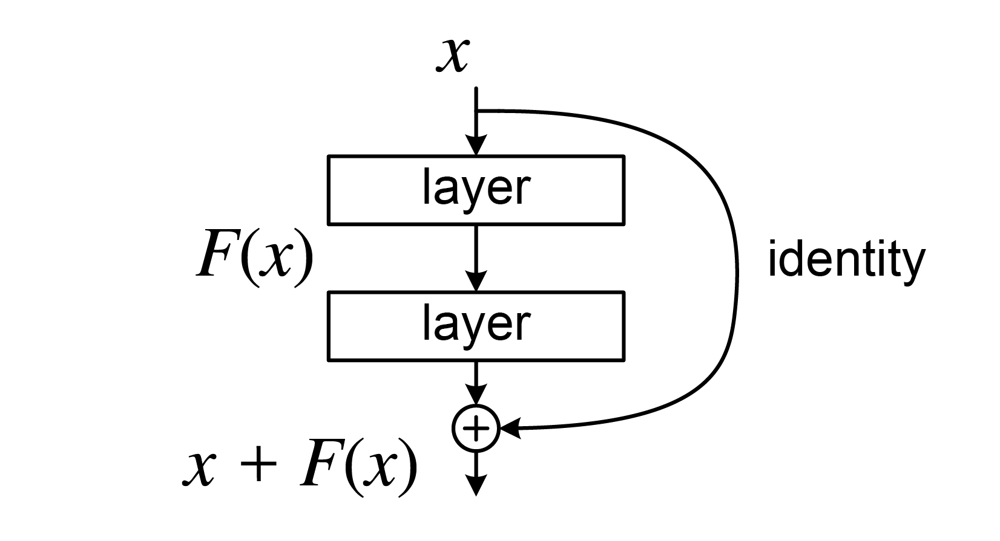

# Residual Network

[TOC]

## Architecture

$$
y = \mathcal{F}(x, \{W_i\}) + x
$$

$$
\begin{align*}
x_{l+1} &= x_l + F(x_l, ω_l)  \\
x_{l+2} &= x_{l+1} + F(x_{l+1}, ω_{l+1}) = x_l + F(x_l, ω_l) + F(x_{l+1}, ω_{l+1})  \\
x_L &= x_l + \sum_{i=l}^{L-1} F(x_{i+1}, ω_{i+1})
\end{align*}
$$

The ResNet (Residual Network) architecture introduces the concept of **residual learning**, which helps to train very deep networks by addressing the vanishing gradient problem. The core idea of ResNet is the use of **skip connections** (also known as residual connections) that allow the gradient to flow more easily during training.

- $x$: the input to the residual block.
- $y$: the output of the residual block.
- $\mathcal{F}(x, \{W_i\})$: the residual function, which typically consists of a few layers (like convolutional layers, batch normalization, ReLU activation). It is a mapping of $x$ to some output via the weights $\{W_i\}$.
- The term $x$ is the **identity mapping**, which is added to the output of the residual function.

### Back Propagation
$$
\frac{∂ \epsilon}{∂ x_l} = \frac{\epsilon}{x_L} \frac{∂ x_L}{x_l} = ∂\frac{∂ \epsilon}{∂ x_L} \left(1 + \frac{∂}{∂ x_l} \sum_{i=l}^{L-1} F(x_i, w_i)\right)
$$
