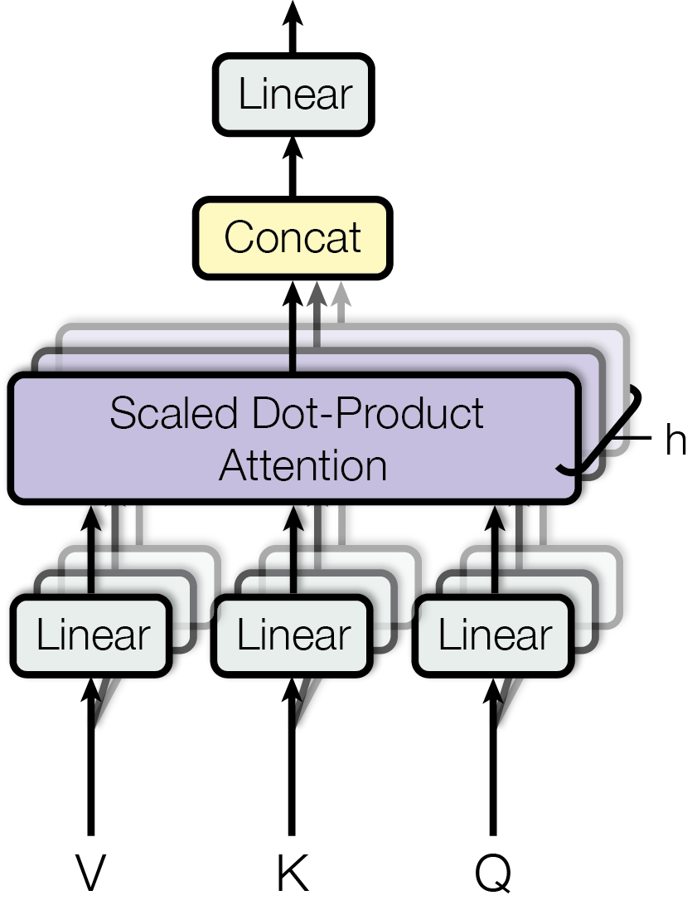
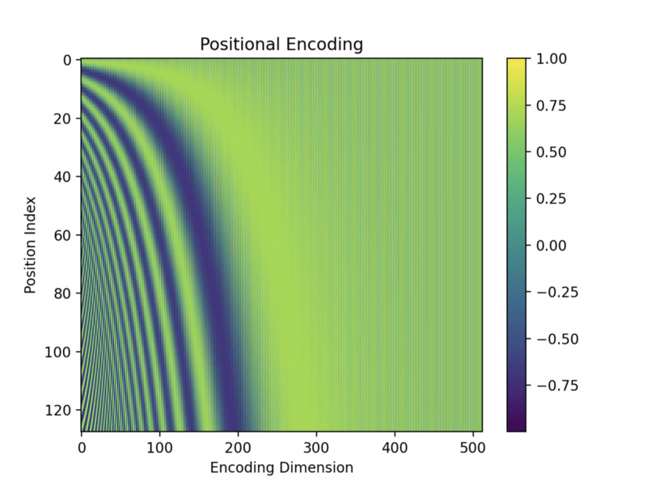

# Self-Attention

[TOC]

## Architecture

$$
\begin{align*}
  Y &= \text{Attention}(Q, K, V)   \tag{Self-Attention}\\
    &= \text{softmax}\left(\frac{Q K^T}{\sqrt{d_k}} \right) V
\end{align*}
$$

$$
\begin{align*}
  Q &= W_Q X  \tag{Quary}\\
  K &= W_K X  \tag{Key}\\
  V &= W_V X  \tag{Value}  
\end{align*}
$$

Self-attention mechanism allows each element in the input sequence (represented by $X$) attends to every other element in the sequence through the queries, keys, and values. This allows the model to capture dependencies between distant elements. The output of the self-attention mechanism is the weighted sum of the values $V$, where the weights are determined by the attention scores calculated using the queries $Q$ and keys $K$.

- $X \in \mathbb R^{L_{seq} \times \dim}$: the input sequence.
- $Y$: The output of the attention mechanism.
- $Q$ **Query**: The query vectors for each element in the input sequence. The query is used to assess the relevance of other elements in the sequence.
- $K$ **Key**: The key vectors for each element in the input sequence. The keys are used to compare with the queries to compute attention scores.
- $V$ **Value**: The value vectors for each element in the input sequence. The values are the actual information being passed through the network, weighted according to the attention scores.
- $d_k$: The dimensionality of the key vector $K$, used to scale the dot product to prevent excessively large values.
- $Q K^T$ **Similarity Scores**: The self-attention mechanism calculates the similarity scores between the query and key elements by taking the dot product of the query and the transposed key embeddings. These similarity scores represent how much each element should contribute to the final output.
- $\text{softmax}\left(\frac{Q K^T}{\sqrt{d_k}} \right)$ **Attention Weights**: The similarity scores are scaled by the square root of the dimension of the key embeddings. The scaled scores are then passed through a softmax function, which normalizes them to sum up to 1, thus obtaining the attention weights, which are then used to weigh the values $V$.

### Multi-Head Self-Attention

$$
\begin{align*}
Y &= \text{MultiHead}(Q,K,V) \\
&= \left(\begin{matrix}\text{Attention}(Q_1, K_1, V_1) & \cdots & \text{Attention}(Q_h, K_h, V_h)\end{matrix}\right) W_O
\end{align*}
$$

**Multi-Head Self-Attention** is an extension of the self-attention mechanism that allows the model to capture different types of relationships in different subspaces of the input sequence. Multi-Head Self-Attention is to perform self-attention multiple times in parallel, with different sets of learned query, key, and value matrices, each focusing on different parts or aspects of the input sequence simultaneously. 

- $X \in \mathbb R^{L_\text{seq} \times d}$: the input sequence.
- $h$ is the number of attention heads.
- $Q_i, K_i, V_i \in \mathbb R^{L_\text{seq} \times \frac{d}{N_\text{head}}}$
- $W_Q, W_K, W_V \in \mathbb R^{d \times d}$: learned weight matrices for attention heads.
- $W_O$: is a learned output weight matrix that projects the concatenated attention heads back into the original space.

## Transformer

A transformer is a deep learning architecture based on the multi-head attention mechanism. In Transformers, self-attention is applied in every layer of both the encoder and decoder to compute contextualized representations of the input or output tokens.

### Encoder

$$
\text{EncoderLayer}_i(x) = \text{LayerNorm}(x + \text{MultiHead}(\text{LayerNorm}(x)))
$$
$$
\text{Encoder}(x) = \text{Position-wiseFeedforward}(\text{EncoderLayer}_N(...(\text{EncoderLayer}_1(x))))
$$

#### Position-Wise Feedforward Network

$$
\text{FFN}(x) = \text{ReLU}(xW_1 + b_1)W_2 + b_2
$$

Each layer of the Transformer includes a fully connected feedforward network applied independently to each position, typically with a ReLU activation.

- $x \in \mathbb{R}^{d_{\text{model}}}$: Input vector for a token.
- $W_1 \in \mathbb{R}^{d_{\text{model}} \times d_{\text{ff}}}$: Weight matrix of the first linear layer.
- $b_1 \in \mathbb{R}^{d_{\text{ff}}}$: Bias vector of the first layer.
- $W_2 \in \mathbb{R}^{d_{\text{ff}} \times d_{\text{model}}}$: Weight matrix of the second layer.
- $b_2 \in \mathbb{R}^{d_{\text{model}}}$: Bias vector of the second layer.

#### Residual Connections

Additive residual connections surround both the self-attention and feedforward sublayers.

#### Layer Normalization

Layer Normalization is a regularization technique used in deep learning to accelerate and stabilize the training process. Its main purpose is to normalize inputs at each layer of the neural network to reduce internal covariate shift issues.

### Decode

$$
\text{DecoderLayer}_i(x, y) = \text{LayerNorm}(x + \text{MultiHead}(\text{LayerNorm}(\text{MaskedSelfAttention}(x, y))))
$$
$$
\text{Decoder}(x, y) = \text{Position-wiseFeedforward}(\text{DecoderLayer}_N(...(\text{DecoderLayer}_1(x, y))))
$$

#### Masked Multi-Head Attention

$$
\text{Attention}(Q, K, V) = \text{softmax}\left(\frac{QK^T}{\sqrt{d_k}} + M\right)V  \\
M = 
\begin{bmatrix}
0 & -\infty & -\infty & -\infty \\
0 & 0 & -\infty & -\infty \\
0 & 0 & 0 & -\infty \\
0 & 0 & 0 & 0
\end{bmatrix}
$$

**Masked Multi-Head Attention** is a variant of the Multi-Head Attention mechanism, specifically used in **decoders** to ensure that predictions at a given position $t$ depend only on positions $ \leq t $ (causality constraint). This masking is crucial for tasks like autoregressive sequence generation, where future information must not influence the current prediction.

- $Q, K, V$: Query, Key, and Value matrices as in standard attention.
- $d_k$: Dimensionality of the keys (used for scaling).
- $M \in \mathbb{R}^{n \times n}$: Mask matrix. For positions that should be masked (i.e., positions in the future), $M_{ij} = -\infty$.  For positions that are valid (i.e., positions up to $t$), $M_{ij} = 0$. The addition of $M$ ensures that the softmax probabilities are zero for masked positions. When added to the scaled dot-product, the softmax ensures that positions in the future ($-\infty$) receive zero probability.

### Input Layer

#### Positional Encoding

$$
\begin{align*}
\boldsymbol p_{t} &= \left\{\begin{matrix} \sin(\omega_k t)  &\quad, \text{if } i = 2k \\  \cos(\omega_k t)  &\quad, \text{if } i = 2k + 1 \\   \end{matrix}\right. \\
\boldsymbol p_{t}&\in \mathbb R^{d_{model}}\\ 
\omega_k &= \left(\frac{1}{10000}\right)^{\frac{2 k}{d_{model}}}
\end{align*}
$$

Since Transformers lack recurrence or convolution, positional encoding is added to the input embeddings to incorporate sequence information.

