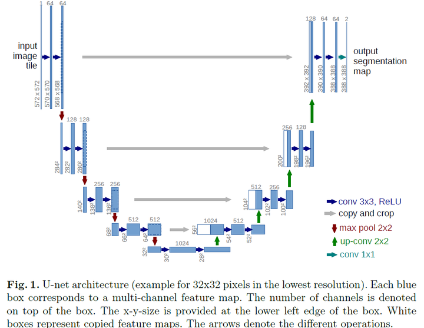

# U-Net

[TOC]

## Architecture

U-Net is a deep learning architecture designed primarily for image segmentation tasks. It is widely used in biomedical image segmentation, where the goal is to label each pixel of the image with a specific class (e.g., background vs. object). U-Net is characterized by its symmetric architecture, consisting of an encoder (downsampling path) and a decoder (upsampling path), with skip connections between corresponding layers in the encoder and decoder.

- **Input**: The input image $x_0$ of size $H \times W \times C$, where $H$ and $W$ are the height and width of the image, and $C$ is the number of channels (e.g., 3 for RGB).
- **Encoder**: Series of convolutions and pooling operations that progressively reduce the spatial resolution.
- **Bottleneck**: The deepest layer of the network, where features are most abstracted.
- **Decoder**: Series of upsampling operations and concatenations with corresponding encoder layers to reconstruct the image with high resolution.
- **Output**: The output $y$ of the network is a segmented image with the same height and width as the input, but with a different number of channels representing the classes.

### Encoder (Contracting Path)

$$
x_i = \mathcal{C}_i(\text{Conv}(x_{i-1}), W_i)
$$

The encoder extracts features from the input image by applying a series of convolutional layers and pooling operations, which progressively reduce the spatial dimensions while increasing the number of feature channels.

- $\mathcal{C}_i$: the operations performed at layer $i$, including convolution, activation function (usually ReLU), and possibly batch normalization.
- $\text{Conv}(x_{i-1})$: the convolution operation applied to the input $x_{i-1}$, where $x_0$ is the initial image.
- $W_i$: the weights of the convolutional layer at level $i$.
- Pooling operations reduce the spatial resolution (usually max pooling).

### Decoder (Expanding Path)

$$
x_i = \mathcal{U}_i(\text{UpConv}(x_{i+1}), x_{n-i})
$$

The decoder gradually upsamples the feature map to restore the spatial resolution of the original image. The decoder uses transposed convolutions or upsampling followed by convolution.

- $\mathcal{U}_i$: the upsampling and concatenation operation at layer $i$.
- $\text{UpConv}(x_{i+1})$: the upsampling operation (often using transposed convolutions) applied to the input $x_{i+1}$ from the deeper layers.
- $x_{n-i}$ is the corresponding feature map from the encoder path, which is concatenated with the upsampled output.

### Final Output

$$
y = \text{Conv}(x_1, W_{\text{out}})
$$

After the final decoding step, a 1x1 convolution is typically applied to reduce the number of output channels to the desired number of classes for segmentation (e.g., 1 for binary segmentation or more for multi-class segmentation).

