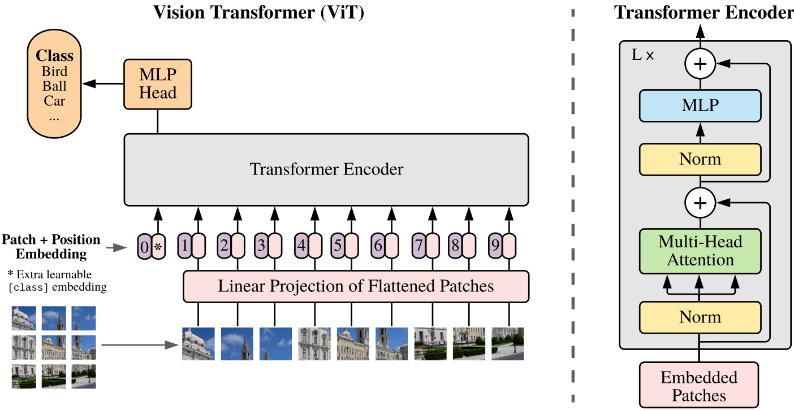

# Visual Transformer

[TOC]

## Architecture

**Vision Transformer (ViT)** is a deep learning model architecture that applies transformer-based techniques to image data. The core idea is to treat an image as a sequence of fixed-size patches and feed them into a transformer model, which was originally designed for sequential data like text.

The sequence of patch embeddings is passed through a transformer encoder. A transformer encoder consists of a series of layers, each with a **multi-head self-attention** mechanism followed by a **feed-forward network** (FFN).

- Paper: *AN IMAGE IS WORTH 16X16 WORDS: TRANSFORMERS FOR IMAGE RECOGNITION AT SCALE*: https://arxiv.org/pdf/2010.11929

### Patch Embedding

$$
\mathbf{y}_i = \boldsymbol{E}\ \text{flatten}(x_i) + \boldsymbol{E}_\text{pos}
$$

**Image Representation as Patches**: Patch embedding in Vision Transformers (ViT) transforms an image into a sequence of patches, which can then be processed by a transformer model. The image is divided into non-overlapping patches of size $ P \times P$. Each patch is flattened into a 1D vector. So, each patch of size $ P^2 \times C$ becomes a vector of size $ P^2  C$. All patches are concatenated to form a sequence of $N$ vectors.

**Linear Projection (Embedding)**: The sequence of flattened patches is then passed through a linear projection (a fully connected layer). This layer projects each patch vector into an embedding space of size $ D$ using a trainable projection matrix $ E$ of shape $ D \times P^2 C$, which is the dimensionality of the transformer model’s input.

**Adding Positional Encoding**: Due to transformers do not inherently process spatial information, the positional encoding allows the model to understand the relative or absolute position of patches in the image. The positional encoding is typically a vector of the same size $D$ as the patch embedding and is added to each patch embedding element-wise.

- **image**: $X \in  \mathbb{R}^{H \times W \times C}$ (height $ H$, width $ W$, and channels $ C$)
- **patch**: $ x_i \in \mathbb{R}^{P^2 \times C}$
- $N$: number of patches $ N = \frac{H}{P} \times \frac{W}{P}$ 
- $flatten(\cdot): \mathbb{R}^{P^2 \times C} \to \mathbb{R}^{P^2C}$: flatten each patch into a 1D vector.
- $ \mathbf{y}_i \in \mathbb{R}^{D}$ is the patch embedding vector.
- $\boldsymbol{E} \in \mathbb{R}^{D \times P^2 C}$: the trainable projection matrix.
- $\boldsymbol{E}_\text{pos}$ is the positional encoding added to preserve spatial relationships (since transformers do not have an inherent understanding of position).