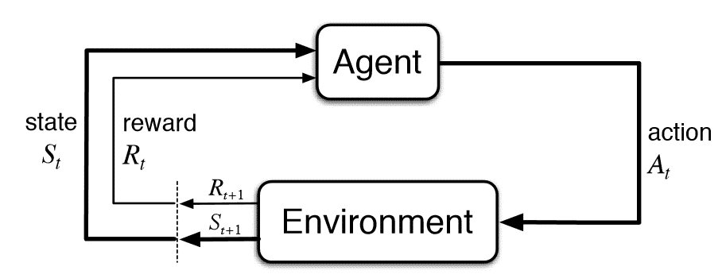

# Reinforcement Learning

[TOC]

## Problem

Let **Agent** interact with unknown **Environment**, and learn how to choose actions $A$ in the current state $S$ to find strategies $\pi$ that can maximize the cumulative Reward $G$. 

The Environment feeds back status $S$ and rewards $R$ based on the action $A$ of the Agent each step.

$$
\max_{\pi} \quad G = \sum_{t = 0}^\infty R_t  \tag{objective}
$$

- $S$: State set 
- $A$: Action set 
- $R$: Reward pre step 
- $G$: Cumulative Reward of all steps 
- $\pi : S_t \to A_t$: Strategy, Policy function 

## Property

### Cumulative Reward of $t$ & Reword discount
$$
G_t= \sum_{\tau = t+1}^T R_\tau  \tag{Cumulative Reward of $t$}
$$
为了避免$T \to ∞, G_t \to ∞$, 引入折扣$γ \in [0,1]$,  
$$
G_t = \sum_{k=0}^∞ γ^k R_{t+k+1} = R_{t+1} + γ G_{t+1}
$$

### Value function & Action-Value function

$$
\begin{align*}
  V &: (S_t, \pi) \to G_t  \tag{Value function}\\
  Q &: (S_t, A_t, \pi) \to G_t  \tag{Action-Value function}
\end{align*} 
$$

Value function: 智能体在当前状态$S_t$和策略$π$下的期望累计收益$G_t$.  
Action-Value function: 智能体在当前状态$S_t$和策略$π$下, 在做出动作$A_t$后的期望累计收益$G_t$.
$$
V(s) = \mathbb E_a(Q(s, a))
$$
A(Advantage)
$$
A(s, a) = Q(s, a) - V(s)
$$

## Include  

### Single State Reinforcement Learning

Reinforcement Learning with only a constant state $S_0$. 
$$
\begin{align*}
  \max_{\pi} \quad & G = \sum_{t = 0}^\infty R_t  \tag{objective}\\
  s.t. \quad
  & R_t = f(A_{t})  \tag{Environmental response}\\
\end{align*}
$$
Probability of rewards,
$$
\mathbb P (R_t | A_t)
$$

### [Markov Decision Process](./Markov_Decision_Process.md)

###  [Multi-Agent Reinforcement Learning](./Multi-Agent_Reinforcement_Learning.md)

## Algorithm
* [Minimax](./Minimax.md)
* [Monte Carlo Tree Search](./Monte_Carlo_Tree_Search.md)