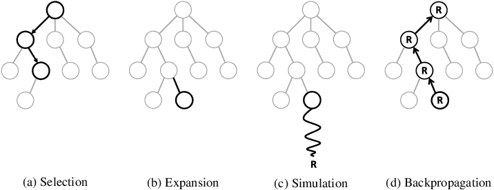

[TOC]

## Value-Based Methods

### Q-Learning & SARSA

$$
Q(s_t, a_t) \leftarrow Q(s_t, a_t) + \alpha [r_{t+1} + \gamma \max_{a} Q(s_{t+1}, a) - Q(s_t, a_t)]
$$

$$
Q(s_t, a_t) \leftarrow Q(s_t, a_t) + \alpha [r_{t+1} + \gamma Q(s_{t+1}, a_{t+1}) - Q(s_t, a_t)]
$$

State-Action-Reward-State-Action (SARSA) is an on-policy learner.

### Deep Q-Networks

## Policy-Based Methods

### Policy Gradient

## 综合方法

### Actor-Critic

The Actor-Critic algorithm is a foundational approach that combines the policy-based and value-based methods. It involves two main components

1. **Actor**: This part of the algorithm proposes actions given the current state. The actor is essentially the policy $\pi(a|s)$ of the agent, which can be either deterministic or stochastic. It's responsible for the actual decision-making process.

2. **Critic**: The critic evaluates the actions taken by the actor by computing the value function $V(s)$ or the action-value function $Q(s, a)$. The critic assesses the quality of the actions given the state of the environment.


- **Policy (Actor) Improvement**: The actor adjusts its policy parameters $\theta$ based on the gradient of expected rewards. It tries to maximize the expected return by considering the feedback from the critic.

- **Value Function (Critic) Estimation**: The critic updates the value function parameters $w$ to more accurately predict the expected return. The difference between the predicted return and the actual return (the temporal difference error, $\delta$) is used to improve the policy.

- **Temporal Difference (TD) Error**: This is a key concept in actor-critic algorithms. The TD error $\delta$ is calculated by the critic and represents the difference between the predicted reward from the current state-action pair and the reward received plus the predicted reward from the next state. The TD error is then used to update both the actor and the critic.

- **Advantages**: Actor-critic methods aim to combine the advantages of both policy-based and value-based approaches. The critic's value function helps reduce the variance of the policy gradient, leading to more stable and efficient learning than policy-based methods alone. At the same time, because the actor maintains an explicit policy, it can be easier to learn and more effective in high-dimensional or continuous action spaces compared to value-based methods.

- **Variants**: There are many variants of the actor-critic algorithm, including A3C (Asynchronous Advantage Actor-Critic), A2C (Advantage Actor-Critic), and SAC (Soft Actor-Critic), each with its own improvements and optimizations for different scenarios.

#### Deep Deterministic Policy Gradient (DDPG)

DDPG is a model-free, off-policy actor-critic algorithm that specifically addresses environments with continuous action spaces.


#### Asynchronous Advantage Actor-Critic (A3C)

### Monte Carlo Tree Search

Evaluate the state formed by possible action.

$$
S_{k} \overset{A_k}{\rightarrow} S_{k+1}
$$



**Select**: Starting from the root node, MCTS uses a combination of exploration and exploitation to select the most promising node to expand.

- Exploration: Selecting nodes that have not been visited often. Using Upper Confidence Bound to choose action $A_k$ for state $S_k$

$$
\tilde V(S_k) = \frac{\sum R_{\text{simulate}}(S_k)}{N_{\text{visit}}(S_k)}
$$

$$
\text{UCD}(S_k) = \tilde V(S_k) + C \sqrt{\frac{\ln(N_{_\text{visit}}(S_{k-1}))}{N_\text{visit}(S_k)}}
$$

- Exploitation: Selecting nodes that have led to good results in the past. 

$$
\tilde{S_k^*} = \arg\max_{S_k \in \mathcal S} \tilde V(S_k)
$$

**Expand**: Once a node has been selected for expansion, MCTS adds one or more child nodes to the tree, representing the possible moves that can be made from that state.  

**Simulate**: Randomly select action base on the input state, and simulate the game until the termination state is reached.

```cpp
while(!isTerminate(s))
  s = nextStateRand(s)

reward = evaluate(s)
```

**Backpropage**: The reward obtained from Simulation is backpropagated from the leaf node to root, and each related node is updated.

```cpp
while (node != NULL) {
  node->value += reward;
  node->visit += 1;
  node = node->parent;
}
```
